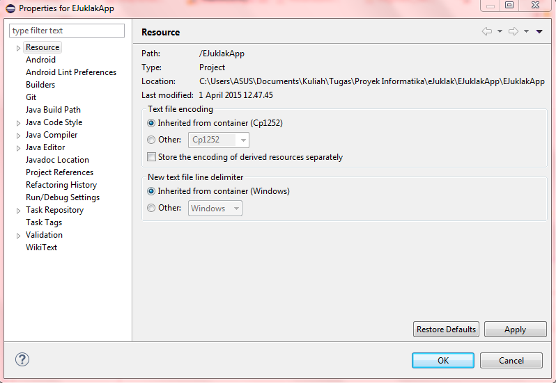
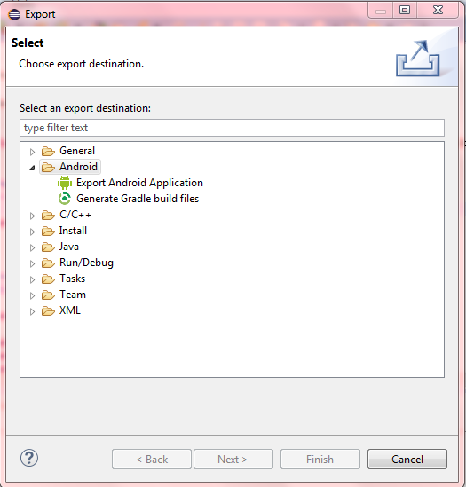

Markdown ini menjelaskan bagaimana untuk menge-build aplikasi dari source code yang ada di repository eJuklak. 
Berikut adalah langkah-langkahnya:

**Cara meng-import project**

1. Clone new repository di komputer menggunakan Github, Git, atau aplikasi lainnya. Link repository yang harus dicantumkan adalah https://github.com/astridsoraya/eJuklak.git.
2. Buka aplikasi IDE yang bisa menge-build aplikasi Android seperti Eclipse.
3. Import project yang berada di dalam folder eJuklakApp. Jangan lupa untuk meng-import appcompat agar eJuklakApp tidak mengalami error saat di-build.
4. Klik kanan project EJuklakApp di Eclipse dan klik properties. Nanti akan muncul halaman tab seperti ini:

5. Pada tab tersebut, klik bagian bernama Android. Scroll ke bagian paling bawah dan akan muncul bagian menu bernama Library.

6. Jika reference menuju appcompat masih error atau bertanda silang/cross berwarna merah, remove reference tersebut dan add new reference dengan appcompat yang sudah di-import sebelumnya ke IDE. Jika reference sudah bertanda centang hijau, reference menuju appcompat sudah benar.

**Cara menge-build aplikasi**

1. Aturlah konfigurasi bagaimana aplikasi akan di-run. Konfigurasi tersebut bisa diatur di menu android yaitu Run. Klik menu drop down di sebelah icon Run dan klik Run configuration. Icon app run dilingkari merah pada gambar berikut ini:

2. Activity default pada EJuklakApp adalah MainActivity sehingga pengguna bisa memilih 'launch default project' atau 'launch MainActivity.java'.
3. Pengguna juga bisa memilih apakah aplikasi akan dijalankan secara otomatis pada emulator device atau handphone device. Pengguna harus menge-klik 'Always prompt to pick device' di tab 'Target' agar bisa memilih. Untuk handphone device, pastikan pengguna sudah meng-install driver handphone dan Google USB Drive di Android SDK.

4. Setelah project di-run, APK akan dibuat secara otomatis. APK adalah merupakan file installer untuk Android. APK ada di dalam folder bin yang ada di project.
5. Selain itu, pengguna juga bisa menge-build APK dengan cara export. Klik menu 'File' dan klik menu 'Export'.

6. Pilih folder Android lalu klik Export Android Application.
7. Pilih project EJuklakApp dan klik next.
8. Pengguna akan ditanya suatu keystore. Keystore ini berfungsi untuk keamanan aplikasi saat aplikasi disebar ke pasaran. Pengguna bisa membuat keystore baru atau memilih keystore yang sudah tersedia.
9. Klik finish dan APK sudah bisa dibuat.

