Cara menggunakan aplikasi
=================

**Cara melakukan navigasi di eJuklak**

1. Saat menjalankan aplikasi, gambar di bawah ini adalah halaman pertama yang akan dilihat oleh pengguna. Ini adalah **home page**.  

2. Untuk memilih konten eJuklak, tekan tombol dropdown di layar terletak pada kiri atas layar pada icon EJuklak, lalu pilih bab dan subbab yang Anda inginkan.  
  
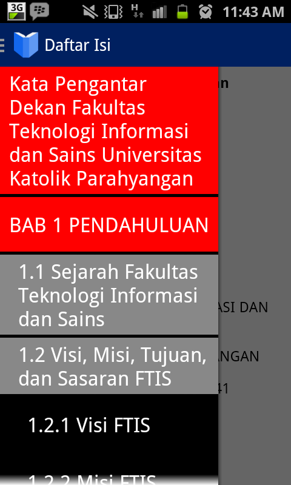
3. Selain menekan tombol ikon dropdown di kiri atas, pengguna juga bisa dapat menampilkan menu navigasi dengan menge-slide layar dari ujung kiri ke kanan.  
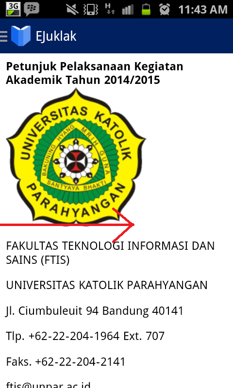  
4. Setelah memilih bab atau subbab tertentu, aplikasi akan langsung menampilkan bab dan subbab yang dipilih. 
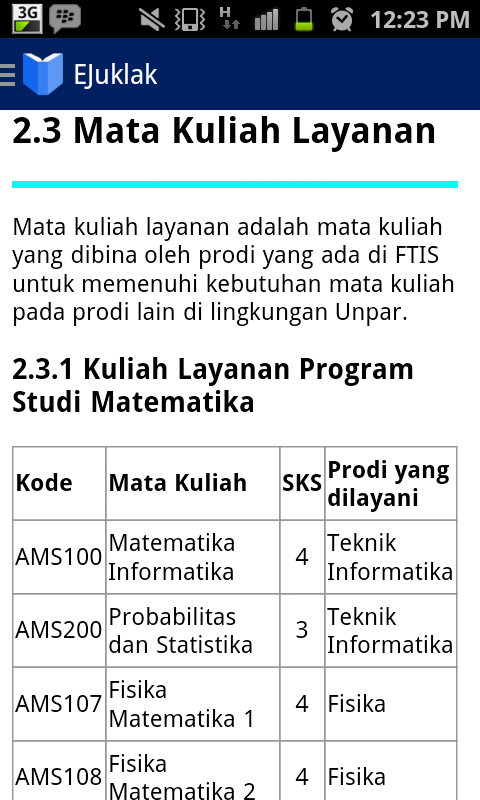

**Cara melihat dan menge-zoom gambar**

1. Untuk menge-zoom gambar, lakukan pinch zoom dengan dua jari.  
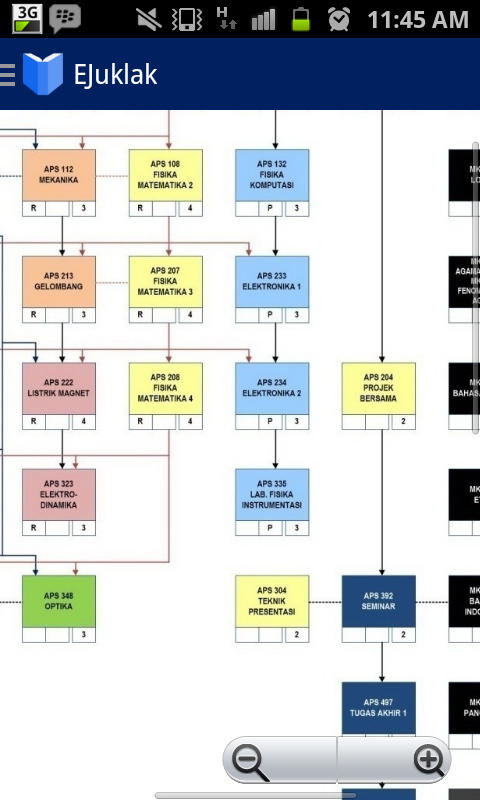

Cara mem-build aplikasi dari source code yang ada di repositori
==============================================================
Markdown ini menjelaskan bagaimana untuk menge-build aplikasi dari source code yang ada di repository eJuklak. 
Berikut adalah langkah-langkahnya:

**Cara meng-import project**

1. Clone new repository di komputer menggunakan Github, Git, atau aplikasi lainnya. Link repository yang harus dicantumkan adalah https://github.com/astridsoraya/eJuklak.git.
2. Buka aplikasi IDE yang bisa menge-build aplikasi Android seperti Eclipse.
3. Import project yang berada di dalam folder eJuklakApp. Jangan lupa untuk meng-import appcompat agar eJuklakApp tidak mengalami error saat di-build.
4. Klik kanan project EJuklakApp di Eclipse dan klik properties. Nanti akan muncul halaman tab seperti ini:
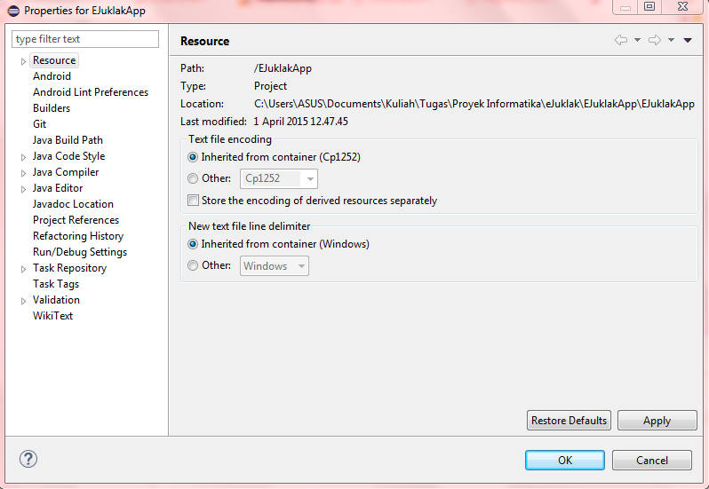
5. Pada tab tersebut, klik bagian bernama Android. Scroll ke bagian paling bawah dan akan muncul bagian menu bernama Library.
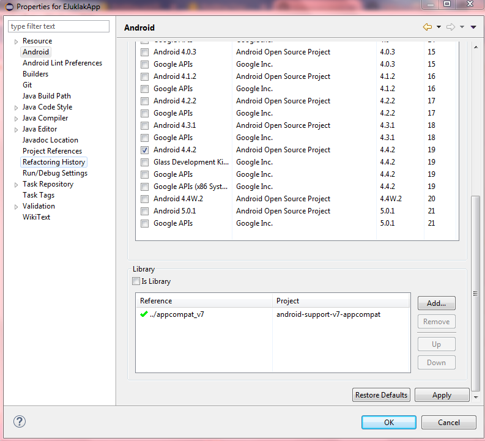
6. Jika reference menuju appcompat masih error atau bertanda silang/cross berwarna merah, remove reference tersebut dan add new reference dengan appcompat yang sudah di-import sebelumnya ke IDE. Jika reference sudah bertanda centang hijau, reference menuju appcompat sudah benar.

**Cara menge-build aplikasi**

1. Aturlah konfigurasi bagaimana aplikasi akan di-run. Konfigurasi tersebut bisa diatur di menu android yaitu Run. Klik menu drop down di sebelah icon Run dan klik Run configuration. Icon app run dilingkari merah pada gambar berikut ini:
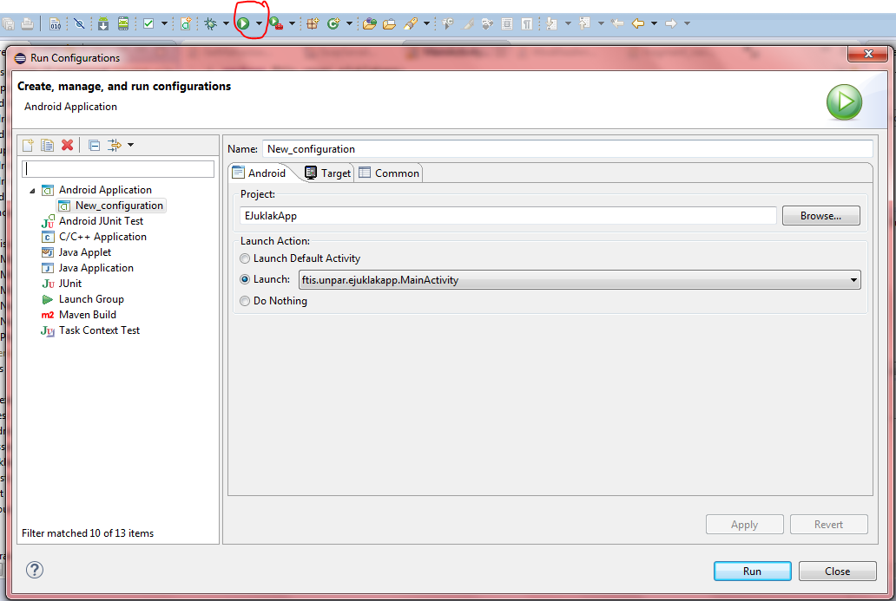
2. Activity default pada EJuklakApp adalah MainActivity sehingga pengguna bisa memilih 'launch default project' atau 'launch MainActivity.java'.
3. Pengguna juga bisa memilih apakah aplikasi akan dijalankan secara otomatis pada emulator device atau handphone device. Pengguna harus menge-klik 'Always prompt to pick device' di tab 'Target' agar bisa memilih. Untuk handphone device, pastikan pengguna sudah meng-install driver handphone dan Google USB Drive di Android SDK.
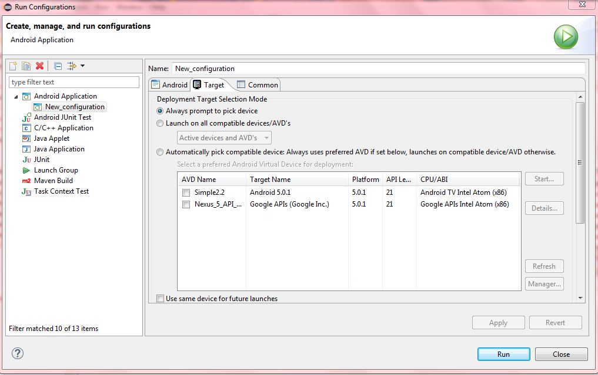
4. Setelah project di-run, APK akan dibuat secara otomatis. APK adalah merupakan file installer untuk Android. APK ada di dalam folder bin yang ada di project.
5. Selain itu, pengguna juga bisa menge-build APK dengan cara export. Klik menu 'File' dan klik menu 'Export'.
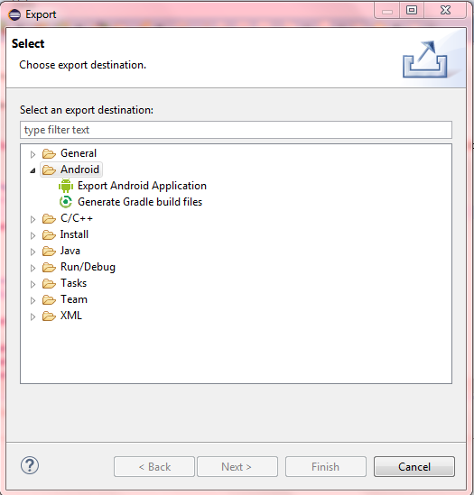
6. Pilih folder Android lalu klik Export Android Application.
7. Pilih project EJuklakApp dan klik next.
8. Pengguna akan ditanya suatu keystore. Keystore ini berfungsi untuk keamanan aplikasi saat aplikasi disebar ke pasaran. Pengguna bisa membuat keystore baru atau memilih keystore yang sudah tersedia.
9. Klik finish dan APK sudah bisa dibuat.

Struktur program
================

## Use Case Diagram
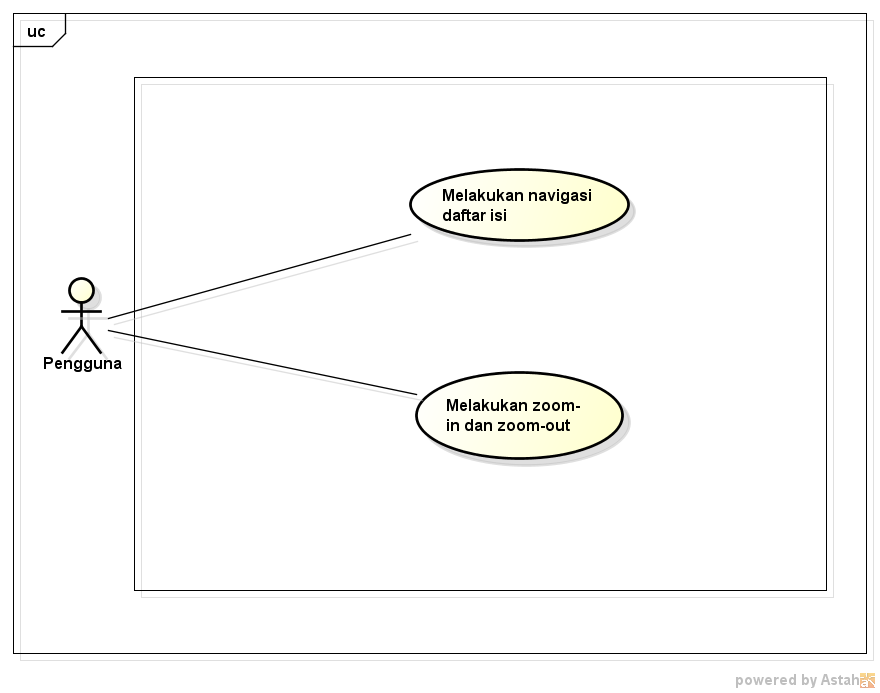

## Class Diagram
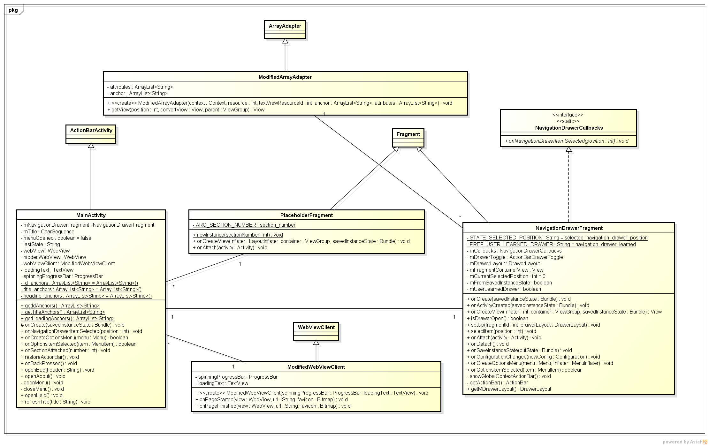

### Class : MainActivity.java

--> kelas utama yang akan ditampilkan pada applikasi
#### Attributes:

 * NavigationDrawerFragment mNavigationDrawerFragment : attribut untuk menyimpan fitur-fitur navigasi dalam bentuk navigation drawer
 * CharSequence mTitle : Menyimpan judul dari app,disimpan dalam bentuk kumpulan character
 * boolean menuOpened=false : attribut untuk menentukan apakah menu navigasi sedang terbuka atau tidak.Diinisialisasi default dengan menu tidak terbuka(false)
 * String lastState :attribut yang menyimpan dimana kalo menu di back akan kembali ke state ini
 * WebView webView: atribut untuk menampilkan konten halaman HTML eJuklak
 * WebView hiddenWebView: atribut untuk menampilkan konten halaman help dan panduan
 * ArrayList <String> attributes;
 * ArrayList <String> anchor;
 * ArrayList <String> id;

#### Methods:

 * (protected)void onCreate(Bundle savedInstanceState) : Method overiding dari class ActionBarActivity.Dijalankan saat pertama kali app dijalankan
  * **parameter(s)**:
  * savedInstanceState-->menerima data berupa bundle attribut dari state sebelumnya
 * (public)void onNavigationDrawerItemSelected(int position) : menghandle aksi yang dilakukan program saat user memilih salah satu menu di navigation drawer.
  * **parameter(s)**:
  * position : mengatur koordinat posisi mana yang dipilih oleh user dan menghandle perpindahan posisi fragment
 * (public)void onSectionAttached(int number):melakukan aksi yang dipilih user pada navigation drawer
  * **parameter(s)**:
  * number:menentukan bab berapa yang akan dibuka oleh program sesuai yang dipilih oleh user
 * (public)boolean onCreateOptionsMenu(Menu menu):Method overiding dari class ActionBarActivity.berfungsi saat menu opsi dijalankan
  * **parameter(s)**:
  * menu : preload menu yang akan ditampilkan saat menu opsi di create
 * (public)void restoreActionBar() : Method yang mengembalikan action bar ke bentuk semula
 * (public)boolean onOptionsItemSelected(MenuItem item) : Method overiding dari ActionBarActivity.berfungsi saat salah satu item dalam menu opsi dijalankan untuk menentukan aksi dari menu yang ditekan
  *  **parameter(s)**:
  *  item : menyimpan MenuItem yang dipilih user yang akan diproses
 * (public)void openBab(String header) : method yang digunakan untuk jump ke halaman bab yang di request oleh user
  * **parameter(s)** :
  *  header : menentukan ke header mana html akan jump
 * (public)void openAbout() : Method yang berfungsi saat user memilih opsi "About" pada menu opsi
 * (public)void openHelp() : Method yang berguna saat user memilih opsi "Help" pada menu opsi
 * (public)void refreshTitle(String title) : method yang berfungsi untuk mengganti title atas pada action bar
  * **parameter(s)** :
  * title : menyimpan title baru yang akan dipakai untuk menggantikan title lama
 * (public)void onBackPressed() : Method Overiding dari class ActionBarActivity.Berfungsi saat tombol back ditekan oleh user.Sementara ini dipakai untuk exit program sepenuhnya

### Class : PlaceHolderFragment.java

--> kelas untuk menyimpan holder fragment.Kelas ini mengextend kelas Fragment dari programming android Eclipse.
#### Attributes:

 * final static String ARG_SECTION_NUMBER="section_numbers" : attribut yang menyimpan section number utama

#### Methods:

 * (public)static PlaceholderFragment newInstance(int sectionNumber) : method untuk membuat instansi section baru
  * **parameter(s)**:
  * sectionNumber : parameter yang akan meminta section number yang di request user
 * (public)View onCreateView(LayoutInflater inflater, ViewGroup container,Bundle savedInstanceState):Method overiding dari class Fragment.Berfungsi saat view dijalankan
  * **parameter(s)**:
  * inflater : parameter default dari eclipse.
  * container :parameter default dari eclipse.Digunakan untuk mengatur tampilan
  * savedInstanceState :menyimpan data yang dibutuhkan untuk activity yang diterima dari activity sebelumnya
 * (public)void onAttach(Activity activity) :method yang dijalankan saat terjadi attach
  * **parameters** :
  * activity : menyimpan activity sebelumnya yang dibutuhkan untuk melakukan attach
 
### Class : NavigationDrawerFragment.java

--> Kelas yang menghandle fragment pada navigation drawer.Kelas ini mengextend kelas Fragmetn yang telah disediakan Eclipse untuk android programming.
#### Attributes:
 * static final String STATE_SELECTED_POSITION = "selected_navigation_drawer_position" : menyimpan posisi dari opsi yang dipilih
 * static final String PREF_USER_LEARNED_DRAWER = "navigation_drawer_learned" : Design guideline dari eclipse
 * NavigationDrawerCallbacks mCallbacks : pointer yang menunjuk ke aktifitas yang sedang berjalan(berguna untuk proses "callback")
 * ActionBarDrawerToggle mDrawerToggle : komponen pembantu untuk menggabungkan "action bar" ke "navigation bar"
 * DrawerLayout mDrawerLayout : komponen pembantu untuk menggabungkan "action bar" ke "navigation bar"
 * ListView mDrawerListView : komponen pembantu untuk menggabungkan "action bar" ke "navigation bar"
 * View mFragmentContainerView : komponen pembantu untuk menggabungkan "action bar" ke "navigation bar"
 * int mCurrentSelectedPosition = 0 : komponen pembantu untuk menggabungkan "action bar" ke "navigation bar"(di inisiasi dengan nilai default =0)
 * boolean mFromSavedInstanceState : komponen pembantu untuk menggabungkan "action bar" ke "navigation bar"
 * boolean mUserLearnedDrawer; : komponen pembantu untuk menggabungkan "action bar" ke "navigation bar"

#### Methods:

 * (public) NavigationDrawerFragment() : pembangkit(constructor)untuk kelas NavigationDrawerFragment(method kosong)
 * (public)void onCreate(Bundle savedInstanceState) : Method overidding dari class Fragment,menghandle apa yang dilakukan saat program dibuka dan NavigationDrawer di create
  * **parameter(s)** :
  * savedInstanceState : menyimpan object bundle yang menyimpan kondisi yang di save untuk dipakai dalam method
 * (public)void onActivityCreated(Bundle savedInstanceState) :Method overidding dari class Fragment yang menghandle aksi yang dilakukan saat membuat aktivitas
  * **parameter(s)** :
  * savedInstanceState : menyimpan object bundle yang menyimpan kondisi yang di save untuk dipakai dalam method
 * (public)View onCreateView(LayoutInflater inflater, ViewGroup container,Bundle savedInstanceState) : Method Overriding class Fragment,berfungsi untuk menghandle view saat program dijalankan
 * **parameter(s)**:
  * inflater : parameter default dari eclipse.
  * container :parameter default dari eclipse.Digunakan untuk mengatur tampilan
  * savedInstanceState :menyimpan data yang dibutuhkan untuk activity yang diterima dari activity sebelumnya
 * (public)boolean isDrawerOpen() : Method untuk menghandle kondisi apakah "Navigation Drawer" sedang terbuka atau tidak
 * (public)void setUp(int fragmentId, DrawerLayout drawerLayout) : Method yang harus dipanggil untuk melakukan set up terhadap interaksi "navigation drawer"
  * **parameter(s)**:
  * fragmentId : ID android untuk aktivitas ini
  * drawerLayout : menyimpan UI dari fragment
 * (public)void onDrawerClosed(View drawerView):Method yang berfungsi saat Drawer ditutup
  * **parameter(s)**:
  * drawerView : Menyimpan current drawerView
 * (public)void onDrawerOpen(View drawerView):Method yang berfungsi saat Drawer dibuka
  * **parameter(s)**:
  * drawerView : Menyimpan current drawerView
 * (private)void selectItem(int position) : Method support yang digunakan untuk memilih opsi pada "Navigation Drawer"
  * **parameter(s)**:
  * position : menyimpan posisi dari opsi yang dipilih
 * (public)void onAttach(Activity activity) : Method yang dipanggil saat aksi pada opsi yang dipilih dijalankan
  * **parameter(s)**:
  * activity : menyimpan aktivitas yang akan dijalankana saat opsi dipilih
 * (public)void onDetach(): Method yang menghandle saat aksi dihentikan
 * (public)void onSaveInstanceState(Bundle outState) : Method yang dipanggil saat state disimpang
  * **parameter(s)** :
  * outState : Menyimpan state yang akan disimpan
 * (public)void onConfigurationChanged(Configuration newConfig) : Method yang dipanggil saat kofigurasi dirubah
  * **parameter(s)** : 
  * newConfig : Menyimpan konfigurasi baru untuk merubah yang lama
 * (public)void onCreateOptionsMenu(Menu menu, MenuInflater inflater) : Method yang dipanggil saat membuat menu untuk opsi
  * **parameter(s)** :
  * menu : menyimpan layout menu untuk membuat menu opsi
  * inflater : attribut default dari eclipse untuk merubah ukuran menu
 * (public)boolean onOptionsItemSelected(MenuItem item) : Method yang menghandle saat item opsi dipilih
  * **parameter(s)** :
  * item :menyimpan item yang dipilih user
 * (private)void showGlobalContextActionBar() : Method bantuan yang menunjukan konteks dari "action bar" secara keseluruhan
 * (private)ActionBar getActionBar() : Method untuk mendapatkan action bar
 * (public)DrawerLayout getMDrawerLayout() : Method untuk mendapatkan drawerLayout
 * (public)static interface NavigationDrawerCallbacks : Memanggil interface "Navigation Drawer"

### Class Interface: NavigationDrawerCallback.java

#### Method

* (default)void onNavigationDrawerItemSelected(int position);
* **parameter(s)** :
* position : menyimpang posisi navigasi drawer
 
### Class : ModifiedArrayAdapter.java

--> Kelas ini berguna untuk memodifikasi list view yang akan ditampilkan di navigation drawer.Kelas ini mengextend ArrayAdapter yang tersedia dari android programming.

#### Attribute(s):

 * ArrayList <String> attributes;
 * ArrayList <String> anchor;
#### Method(s):

 * (public)ModifiedArrayAdapter(Context context, int resource,int textViewResourceId, ArrayList<String> anchor, ArrayList<String> attributes) : Constructor untuk kelas ModifiedArrayAdapter.
  * **parameter(s)** :
  * context : menyimpan isi dari ArrayAdapter
  * resource : menyimpan jumlah resource yang disimpan
  * textViewResourceId :menyimpan id dari resource pada text
  * anchor : menyimpan element dalam header untuk jump
  * attributes : menyimpan header untuk jump
 * (public)View getView(int position, View convertView, ViewGroup parent) :method overriding  dari kelas ArrayAdapter untuk mendapatkan view.
  * **parameter(s)** :
  * position : menyimpan posisi dari list view
  * convertView : menyimpan jenis view untuk list view pada navigation drawer
  * parent : menyimpan parent-parent dari kelas turunan ini.
 
### Class:ModifiedWebView.java

--> kelas untuk modifikasi web view.Kelas ini mengextend WebViewClient yang tersedia pada android programming Eclipse
#### Attribute(s):

 * ProgressBar spinningProgressBar : attribut yang menyimpan tampilan progress bar yang berputar.
 * TextView loadingText : menyimpan text yang muncul saat program di load.
#### Method(s):

 * (public)ModifiedWebViewClient(ProgressBar spinningProgressBar, TextView loadingText) : method constructor untuk kelas ModifiedWebViewClient.
  * **parameter(s)**:
  * spinningProgressBar : parameter untuk memasukan jenis spinningProgressBar
  * loadingText : parameter untuk memasukan text apa yang akan muncul saat loading program.
 * (public)void onPageStarted (WebView view, String url, Bitmap favicon): method yang dipanggil saat page diload.
  *  **parameter(s)** :
  *  view : memasukan view yang dipakai untuk menampilkan web view.
  *  url : menyimpan link untuk menuju page di mana content disimpan.
  *  favicon : parameter dari eclipse.
 * (public)void onPageFinished (WebView view, String url) : method yang dipanggil saat page ditutup.
  * **parameter(s)**:
  * view : menyimpan view yang akan ditutup saat page ditutup 
  * url : menyimpan link yang ditutup saat page ditutup.

**Frameworks**
**Jsoup Framework:**
Jsoup framework adalah framework berupa libary java untuk bekerja dalam html.Guna utama dari Jsoup framework ini adalah parsing dan API editor.Pada app kami,kami gunakan Jsoup ini untuk membangkitkan parsing-parsing bab secara otomatis dengan pemecahnya yakni header (h1,h2,h3,...,h6).Kelemahan pemakaian framework ini adalah lambat,namun,Jsoup ini merupakan open source sehingga support untuk di improve

## Sequence Diagram
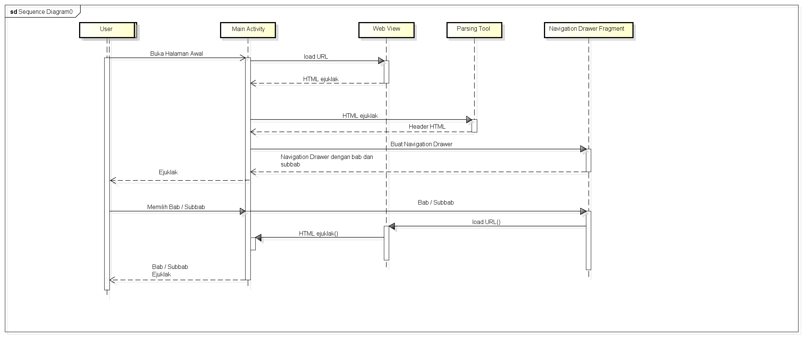
