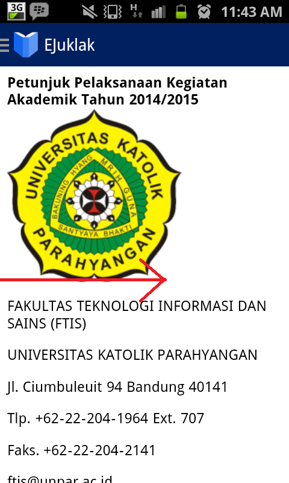

Help
=================

**Cara melakukan navigasi di eJuklak**

1. Saat menjalankan aplikasi, gambar di bawah ini adalah halaman pertama yang akan dilihat oleh pengguna. Ini adalah **home page**.  

2. Untuk memilih konten eJuklak, tekan tombol dropdown di layar terletak pada kiri atas layar pada icon EJuklak, lalu pilih bab dan subbab yang Anda inginkan.  
  

3. Selain menekan tombol ikon dropdown di kiri atas, pengguna juga bisa dapat menu navigasi menge-slide layar dari ujung kiri ke kanan.  
  
4. Setelah memilih bab atau subbab tertentu, aplikasi akan langsung menampilkan bab dan subbab yang dipilih. 

**Cara melihat dan menge-zoom gambar**

1. Untuk menge-zoom gambar, klik salah satu gambar. Gambar yang bisa di-zoom hanya gambar peta mata kuliah dan lampiran.  

2. Setelah menge-klik, pengguna bisa melakukan zoom-in dan zoom-out terhadap gambar.  

3. Jika pengguna ingin kembali ke halaman utama EJuklak, tekan tombol 'back' pada handphone.  
