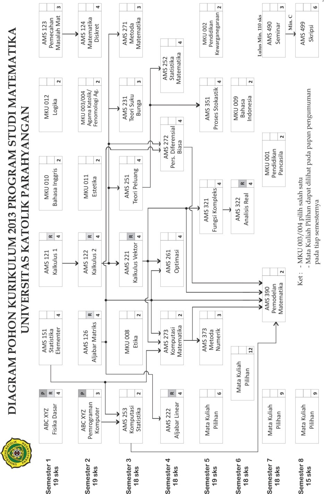
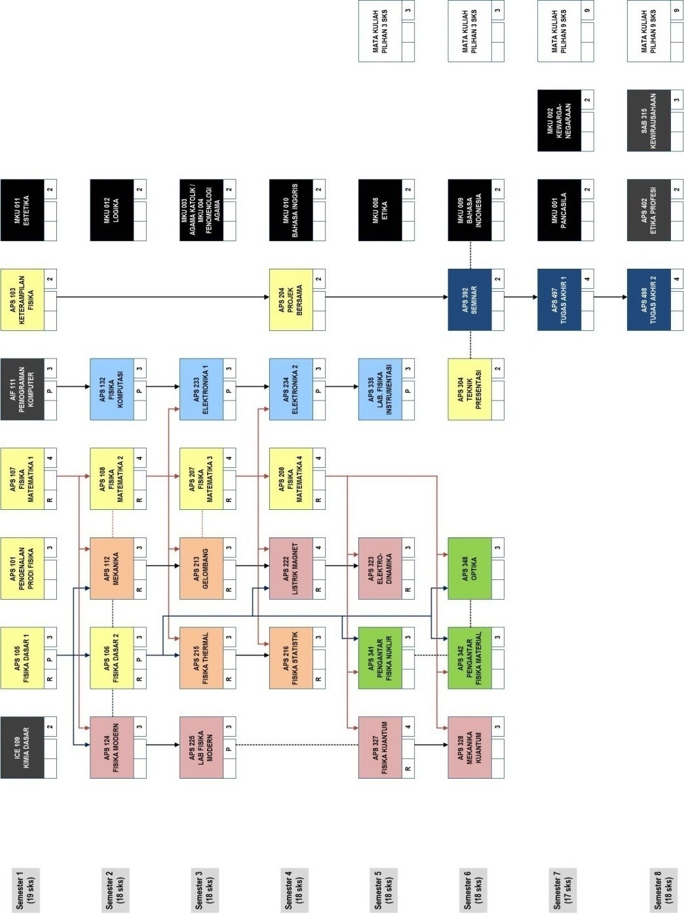

BAB 2 PENYELENGGARAAN MATA KULIAH  
==================================

Secara umum, mata kuliah yang diselenggarakan oleh program studi dapat 
dikelompokkan ke dalam dua jenis yaitu **mata kuliah wajib** dan **mata kuliah 
pilihan**. Mata kuliah wajib merupakan mata kuliah yang sifatnya wajib/harus 
ditempuh oleh setiap mahasiswa. Sebagian dari mata kuliah wajib tersebut 
termasuk ke dalam kelompok **mata kuliah umum** (MKU), yaitu mata kuliah yang 
terkait dengan pengembangan kepribadian yang diselenggarakan oleh Lembaga 
Pengembangan Humaniora. 

Mata kuliah pilihan bertujuan untuk menyiapkan mahasiswa untuk memasuki 
dunia kerja dan memperluas wawasan mahasiswa terhadap bidang ilmu lain 
sehingga memungkinkan melakukan tugas interdisiplin. Mata kuliah pilihan dapat 
diambil dari mata kuliah pilihan yang diselenggarakan oleh program studi (prodi) 
yang bersangkutan, atau mata kuliah (baik wajib maupun pilihan) yang 
diselenggarakan oleh prodi lain di lingkungan UNPAR. Mahasiswa mengambil 
mata kuliah pilihan berdasarkan persetujuan dari dosen wali.

Selain beberapa mata kuliah di atas, dikenal juga apa yang disebut dengan 
**mata kuliah prasyarat**. Mata kuliah prasyarat adalah mata kuliah yang harus 
ditempuh seorang mahasiswa sebelum ia dapat menempuh suatu mata kuliah 
tertentu. 

Di samping mata kuliah yang ditujukan untuk program studinya 
sendiri, prodi-prodi juga menyelenggarakan mata kuliah yang ditujukan untuk 
program studi lain. Mata kuliah ini disebut dengan **mata kuliah layanan**.

Selain tatap muka di kelas, suatu mata kuliah dapat mengandung kegiatan lain 
untuk mendukung perkuliahan, yaitu asistensi, responsi, atau praktikum yang 
biasa disingkat dengan **APR**.

## 2.1 Mata Kuliah Pilihan

Mahasiswa harus menempuh sejumlah SKS tertentu mata kuliah pilihan, dengan 
sejumlah SKS di antaranya mata kuliah yang diselenggarakan prodinya. Jumlah 
SKS mata kuliah ini berbeda-beda untuk setiap prodi:
   1. Untuk Matematika, 48 SKS dengan minimal lulus 15 SKS berasal dari salah 
   satu bidang kajian (Rekayasa Keuangan atau Matematika Industri).
   2. Untuk Fisika, 24 SKS yang dapat diambil dari seluruh prodi di UNPAR.
   3. Untuk Teknik Informatika, 30 SKS dengan banyaknya mata kuliah pilihan dari 
   luar jurusan yang dapat diperhitungkan dalam kelulusan adalah 
   sebanyak-banyaknya 4 (empat) mata kuliah.

Untuk mata kuliah pilihan, terdapat beberapa ketentuan sebagai berikut:
   1.	Bila mata kuliah tersebut memiliki prasyarat, mahasiswa dari prodi lain tidak 
    perlu memenuhi prasyarat tersebut.
   2. Mata kuliah pilihan dan mata kuliah di prodi lain yang ekivalen dengannya, 
   hanya dapat diperhitungkan salah satunya.

## 2.2 Mata Kuliah Prasyarat

   1. **Prasyarat tempuh**, artinya mata kuliah tersebut telah terdaftar dalam 
   rencana studi mahasiswa yang bersangkutan dan bernilai akhir A, B, C, D, 
   atau E, walaupun tentunya kelulusan akan sangat menunjang penempuhan 
   mata kuliah berikutnya.
   2. **Prasyarat lulus**, artinya mahasiswa harus lulus mata kuliah prasyarat 
   tersebut terlebih dahulu. Pada umumnya, syarat kelulusan adalah nilai akhir 
   minimum D, meskipun ada juga yang lebih tinggi. Silakan melihat silabus 
   mata kuliah ybs. untuk keterangan lebih lanjut.
   3. Mahasiswa di luar prodi penyelenggara mata kuliah tidak wajib memenuhi 
   prasyarat ini.

## 2.3 Mata Kuliah Layanan
Mata kuliah layanan adalah mata kuliah yang dibina oleh prodi yang ada di FTIS 
untuk memenuhi kebutuhan mata kuliah pada prodi lain di lingkungan UNPAR.

### 2.3.1 KULIAH LAYANAN PROGRAM STUDI MATEMATIKA
| Kode   | Mata Kuliah                 | SKS | Prodi yang dilayani |
|--------|-----------------------------|-----|---------------------|
| AMS100 | Matematika Informatika      |  4  | Teknik Informatika  |
| AMS200 | Probabilitas dan Statistika |  3  | Teknik Informatika  |
| AMS107 | Fisika Matematika 1         |  4  | Fisika              |
| AMS108 | Fisika Matematika 2         |  4  | Fisika              |
| AMS103 | Kalkulus I                  |  2  | Teknik Industri     |
| AMS104 | Kalkulus II                 |  2  | Teknik Industri     |
| AMS203 | Matriks dan Ruang Vektor    |  3  | Teknik Industri     |
| AMS204 | Kalkulus Peubah Banyak      |  2  | Teknik Industri     |
| AMS105 | Kalkulus I                  |  3  | Teknik Kimia        |
| AMS106 | Kalkulus II                 |  3  | Teknik Kimia        |
| AMS101 | Matematika 1                |  3  | Teknik Sipil        |
| AMS102 | Matematika 2                |  3  | Teknik Sipil        |
| AMS201 | Matematika 3                |  3  | Teknik Sipil        |
| AMS202 | Matematika 4                |  3  | Teknik Sipil        |

### 2.3.2 KULIAH LAYANAN PROGRAM STUDI FISIKA

| Kode    | Mata Kuliah                 | SKS | Prodi yang dilayani |
|-------- |-----------------------------|-----|---------------------|
| APS 181 | Matematika Informatika      |  4  | Teknik Informatika  |
| APS 182 | Probabilitas dan Statistika |  3  | Teknik Informatika  |
| APS 183 | Fisika Matematika 1         |  4  | Fisika              |
| APS 184 | Fisika Matematika 2         |  4  | Fisika              |
| APS 185 | Kalkulus I                  |  2  | Teknik Industri     |
| APS 186 | Kalkulus II                 |  2  | Teknik Industri     |
| APS 187 | Matriks dan Ruang Vektor    |  3  | Teknik Industri     |
| APS 188 | Kalkulus Peubah Banyak      |  2  | Teknik Industri     |
| APS 189 | Kalkulus I                  |  3  | Teknik Kimia        |
| FFT 113 | Kosmologi                   |  2  | Filsafat            |

### 2.3.3 KULIAH LAYANAN PROGRAM STUDI TEKNIK INFORMATIKA

| Kode    | Mata Kuliah                 | SKS | Prodi yang dilayani |
|-------- |-----------------------------|-----|---------------------|
| AKS 144 | Pemrograman Komputer        |  3  | Matematika          |

## 2.4 Mata Kuliah Umum
Mata kuliah Umum (MKU) adalah mata kuliah kepribadian yang diselenggarakan 
oleh Lembaga Pengembangan Humaniora (LPH). Silabus, jadwal kuliah, materi, 
dan penyediaan serta penugasan dosen seluruhnya diatur oleh LPH. Semester 
penyelenggaraan setiap MKU disesuaikan dengan kurikulum masing-masing prodi. 
 
### 2.4.1 Susunan Mata Kuliah Umum

|  Kode  |         Mata Kuliah        | SKS |   
|:------:|:--------------------------:|----:|   
| MKU001 | Pendidikan Pancasila       |  2  |  
| MKU002 | Pendidikan Kewarganegaraan |  2  |  
| MKU003 | Agama Katolik              |  2  |   
| MKU004 | Fenomenologi Agama         |  2  |   
| MKU008 | Etika                      |  2  |
   
|  Kode  |    Mata Kuliah   | SKS |
|:------:|:----------------:|----:|
| MKU009 | Bahasa Indonesia |  2  |
| MKU010 | Bahasa Inggris   |  2  |
| MKU011 | Estetika         |  2  |
| MKU012 | Logika           |  2  |

### 2.4.2 Uraian Singkat Mata Kuliah Umum

| Kode MK | Prasyarat | Nama dan Deskripsi Mata Kuliah                                                                      |
|---------|-----------|-----------------------------------------------------------------------------------------------------|
| MKU001  |     -     | **PENDIDIKAN PANCASILA/_PANCASILA EDUCATION_** Mata Kuliah Pendidikan Pancasila berupaya                                     menelaah/mengkaji berbagai fenomena kehidupan bangsa dan Negara Indonesia sebagai sebuah ruang publik                         dengan menggunakan pendekatan hermeneutika (filsafat) dan pendidikan nilai (pedagogik). Dengan                               bantuan hermenutika mahasiswa diajak berpikir kritis terhadap segala bentuk ideologisme Pancasila dan                         melalui pendidikan nilai mahasiswa dilatih untuk memiliki nilai Pancasila. Nilai pengembangan diri                           intra-personal dan relasi inter-personal dapat tertanam melalui pendidikan Pancasila yang tujuannya                          adalah membangun kepribadian (*character building*) manusia Indonesia yang utuh, baik menyangkut                             aspek kognitif, afektif, maupun psikomotor. Dengan demikian, Pendidikan Pancasila mengajak mahasiswa                         menilai realitas ruang publik sehari-hari secara mandiri dengan panduan nilai-nilai etis Pancasila. | 
| MKU002  |     -     | **PENDIDIKAN KEWARGANEGARAAN/_CIVICS_** Pendidikan Kewarganegaraan menjelaskan pentingnya pemahaman                          tentang identitas nasional Indonesia, hak dan kewajiban warga negara Indonesia serta hubungannya                             dengan hak dan kewajiban asasi manusia. Materi kuliah mencakup juga wawasan nusantara, ketahanan                             nasional, politik dan strategi nasional, serta implementasinya dalam kehidupan bermasyarakat,                                berbangsa dan bernegara kesatuan Republik Indonesia.                                                |
| MKU003  |     -     | **AGAMA KATOLIK/_CATHOLIC RELIGION_** Mata kuliah ini membentuk karakteristik mahasiswa sebagai                              manusia yang memiliki religiusitas melalui pendalaman akan makna agama dan beragama, mendeteksi                              dinamika Wahyu Tuhan dan iman mereka, memahami relasi dengan Tuhan dan sesama, mengenal makna                                keselamatan dalam konteks Kerajaan Allah, dan mampu menyatakan ajaran Gereja dalam pelayanan terhadap                         orang miskin dan terlantar.                                                                         |
| MKU004  |    -      | **FENOMENOLOGI AGAMA/_PHENOMENOLOGY OF RELIGION_** Fenomenologi Agama merupakan bagian yang tak                              terpisahkan dari kajian filosofis, kritis, rasional, dan obyektif mengenai substansi ajaran agama.                           Fenomenologi merupakan sebuah disiplin ilmu yang secara kritis-rasional mengkaji fenomena dan                                dinamika kehidupan manusia beragama, dari upaya menjadikan Tuhan sebagai tujuan sesembahan sampai                            menempatkan Tuhan sebagai instrumen legitimasi untuk melakukan tindakan yang justru bertolak belakang                         dengan kehendak Tuhan yang disembah. Sehubungan dengan itu, kritik konstruktif terhadap perilaku                             manusia beragama menjadi salah satu poin utama dalam mata kuliah ini. Kesediaan untuk melakukan                              otoritik terhadap agama sendiri erat terkait dengan upaya menemukan kembali nilai sejati agama atau                          otentisitas hidup beragama.                                                                         |
| MKU008  |     -     | **ETIKA/_ETHICS_** Mendalami perilaku sehari-hari yang baik dalam bermasyarakat.                    |
| MKU009  |     -     | **BAHASA INDONESIA/_INDONESIAN_** Tujuan dari mata kuliah ini adalah untuk mendalami keterampilan                            berbahasa Indonesia, agar mampu mengkomunikasikan hasil pemikiran serta meningkatkan keterampilan                            dalam menyusun karya ilmiah. Mata kuliah Bahasa Indonesia ini dimulai dengan mempelajari penulisan                           kata baku dan non baku serta pengungkapan pikiran dengan pungtuasi yang benar. Selanjutnya,                                  dipelajari penyusunan kalimat yang baku serta menghubungkan kalimat-kalimat yang padu dalam                                  menuangkan gagasan dalam sebuah paragraf. Selain itu, dalam mata kuliah ini dipelajari cara menyusun                         surat dinas yang jelas dan komunikatif. Di akhir kuliah ini, mahasiswa diberi tugas penyusunan                               makalah dengan benar.                                                                    |          
| MKU010  |     -    | **BAHASA INGGRIS/_ENGLISH_** Mata kuliah ini difokuskan pada pemahaman sumber referensi dalam Bahasa                         Inggris dan pengembangan kosakata Bahasa Inggris (*vocabularies*). Hampir keseluruhan waktu                                 perkuliahan didedikasikan untuk menjelaskan metode mengekstraksi isi bacaan secara tepat dan melatih                         mahasiswa untuk menerapkan metode tersebut seraya menambah kosakata-kosakata baru. Mahasiswa juga                           dilatih untuk mempresentasikan hasil pemahamannya akan isi bahan bacaan.                                          |
| MKU011  |    -     | **ESTETIKA/_ESTHETICS_** Mata kuliah estetika memberi pemahaman konseptual filosofis “seni” dalam                            khasanah keilmuan, pembentukan kesadaran ekologis juga dalam proses pembudayaan dan peradaban. Mata                         kuliah ini akan menjadi fondasi bagi mahasiswa untuk memahami dan mempraktekkan seni dari sudut                             pandang filsafat, sejarah, kultural, dan global. Melalui mata kuliah ini, mahasiswa mempelajari                             mengenai dunia manusia (manusia dan pikirannya), pluralitas dan relativitas seni, serta                                     aliran-aliran seni rupa Barat.     |
| MKU012  |    -     | **LOGIKA/_LOGICS_** Perkuliahan logika ditujukan untuk memberikan dasar-dasar keterampilan berpikir                          rasional dan sistematik. Isinya mencakup keterampilan berpikir deduktif dan induktif, seperti                               silogisme, argumen analogikal dan generalisasi induktif. Pembahasan teoretis disertai pula dengan                           pelatihan praktis yang diarahkan pada proses berpikir. Untuk menajamkan kemampuan berpikir tersebut,                         mahasiswa dilatih pula mengidentifikasi kerancuan-kerancuan (*fallacies*) yang sering dijumpai baik                         dalam kehidupan sehari-hari maupun dalam konteks akademik.
Mata kuliah yang saling menggantikan: Agama Katolik-Fenomenologi Agama.

## 2.5 Kurikulum Program Studi Matematika

### 2.5.1 Susunan Mata Kuliah

**Semester 1**

| KODE   | NAMA                         |  APR  | SKS |
|--------|------------------------------|-------|-----|
| AMS121 | Kalkulus 1                   |   R   |  4  |
| AMS123 | Pemecahan Masalah Matematika |       |  3  |
| AMS151 | Statistika Elementer         |       |  4  |
| APS181 | Fisika Dasar                 | R, P  |  4  |
| MKU012 | Logika                       |   R   |  2  |
| MKU010 | Bahasa Inggris               |       |  2  |
|        |                              | TOTAL |  18 |

**Semester 2**

| KODE   | NAMA                         |  APR  | SKS |
|--------|------------------------------|-------|-----|
| AMS122 | Kalkulus 2                   |       |  4  |
| AMS124 | Matematika Diskret           |       |  4  |
| AMS126 | Aljabar Matriks              |       |  4  |
| AIF112 | Pemrograman Komputer         |       |  3  |
| MKU011 | Estetika                     |       |  2  |
| MKU003 | Agama Katolik +              |       |  2  |
| MKU004 | Fenomenologi Agama +         |       |     |
|        |                              | TOTAL |  19 |

**Semester 3**

| KODE   | NAMA                         |  APR  | SKS |
|--------|------------------------------|-------|-----|
| AMS221 | Kalkulus Vektor              |   R   |  4  |
| AMS231 | Teori Suku Bunga             |       |  3  |
| AMS251 | Teori Peluang                |       |  4  |
| APS253 | Komputasi Statistika         |       |  2  |
| AMS271 | Metoda Matematika            |       |  3  |
| MKU008 | Etika                        |   R   |  2  |
|        |                              | TOTAL |  18 |

**Semester 4**

| KODE   | NAMA                         |  APR  | SKS |
|--------|------------------------------|-------|-----|
| AMS222 | Aljabar Linear               |   R   |  4  |
| AMS252 | Statistika Matematika        |       |  4  |
| AMS261 | Optimasi                     |       |  4  |
| AMS272 | Persamaan Diferensial Biasa  |       |  4  |
| AMS273 | Komputasi Matematika         |       |  2  |
|        |                              | TOTAL |  18 |

**Semester 5**

| KODE   | NAMA                         |  APR  | SKS |
|--------|------------------------------|-------|-----|
| AMS321 | Fungsi Kompleks              |       |  4  |
| AMS351 | Proses Stokastik             |       |  4  |
| AMS373 | Metoda Numerik               |       |  3  |
| MKU002 | Pendidikan Kewarganegaraan   |       |  2  |
| ABCXYZ | Pilihan                      |       |  6  |
|        |                              | TOTAL |  18 |

**Semester 6**

| KODE   | NAMA                         |  APR  | SKS |
|--------|------------------------------|-------|-----|
| AMS322 | Analisis Real                |   R   |  4  |
| MKU009 | Bahasa Indonesia             |       |  4  |
| ABCXYZ | Pilihan                      |       |  12 |
|        |                              | TOTAL |  18 |

**Semester 7**

| KODE   | NAMA                         |  APR  | SKS |
|--------|------------------------------|-------|-----|
| AMS940 | Seminar                      |       |  3  |
| AMS491 | Pemodelan Matematika         |       |  4  |
| MKU001 | Pancasila                    |       |  2  |
| ABCXYZ | Pilihan                      |       |  9  |
|        |                              | TOTAL |  18 |

**Semester 8**

| KODE   | NAMA                         |  APR  | SKS |
|--------|------------------------------|-------|-----|
| AMS499 | Skripsi                      |       |  6  |
| ABCXYZ | Pilihan                      |       |  9  |
|        |                              | TOTAL |  18 |

### 2.5.2 Mata Kuliah Pilihan Program Studi Matematika
Mata kuliah pilihan dibagi ke dalam tiga kelompok, yaitu kelompok bidang kajian 
Rekayasa Keuangan, kelompok bidang kajian Matematika Industri, dan 
kelompok di luar kedua bidang kajian. Selain itu, ada satu mata kuliah pilihan 
Proyek Pemodelan yang dirancang sesuai dengan kebutuhan tugas akhir.  

**Kelompok Bidang Kajian: Rekayasa Keuangan**

**Matematika Asuransi**

| KODE   | NAMA                         |  APR  | SKS |
|--------|------------------------------|-------|-----|
| AMS330 | Pengantar Matematika Asuransi|       |  3  |
| AMS331 | Matematika Asuransi          |       |  3  |
| AMS431 | Metoda Statistika Asuransi   |       |  3  |
| AMS342 | Teori Risiko                 |       |  3  |

**Matematika Keuangan**

| KODE   | NAMA                         |  APR  | SKS |
|--------|------------------------------|-------|-----|
| AMS341 | Komputasi Keuangan           |       |  3  |
| AMS342 | Matematika Keuangan          |       |  3  |
| AMS433 | Analisis Deret Waktu         |       |  3  |
| AMS441 | Teori Manajemen Investasi    |       |  3  |
| AMS442 | Ekonometrika Keuangan        |       |  3  |
| AMS440 | Kapita Selekta Matematika Keuangan   |      |  3  |

**Kelompok Bidang Kajian: Rekayasa Keuangan**

**Optimasi dan Teori Kontrol**

| KODE   | NAMA                         |  APR  | SKS |
|--------|------------------------------|-------|-----|
| AMS361 | Pemrograman Linear           |       |  3  |
| AMS461 | Kontrol Optimum              |       |  3  |
| AMS462 | Kontrol Linear               |       |  3  |

**Statistika & Penelitian Operasional**

| KODE   | NAMA                         |  APR  | SKS |
|--------|------------------------------|-------|-----|
| AMS352 | Pemrograman Stokastik        |       |  3  |
| AMS353 | Pengendalian Mutu            |       |  3  |
| AMS354 | Model Statistika             |       |  3  |
| AMS451 | Teori Permainan              |       |  3  |
| AMS452 | Proyek Pemodelan             |       |  3  |
| AMS453 | Statistika Multivariat       |       |  3  |
   
| KODE   | NAMA                         |  APR  | SKS |
|--------|------------------------------|-------|-----|
| AMS454 | Statistika Non Parameter     |       |  3  |
| AMS455 | Perancangan Percobaan        |       |  3  |
| AMS456 | Teori Antrian                |       |  3  |
| AMS457 | Keandalan                    |       |  3  |
| AMS350 | Kapita Selekta Statistika    |       |  3  |
| AMS450 | Kapita Selekta Penelitian Operasional|       |  3  |

**Matematika Terapan**

| KODE   | NAMA                         |  APR  | SKS |
|--------|------------------------------|-------|-----|
| AMS471 | Sistem Dinamik               |       |  3  |
| AMS472 | Matematika Biologi           |       |  3  |
| AMS371 | Persamaan Diferensial Parsial|       |  3  |
   
| KODE   | NAMA                         |  APR  | SKS |
|--------|------------------------------|-------|-----|
| AMS372 | Metoda Matematika Lanjut     |       |  3  |
| AMS374 | Analisi Numerik              |       |  3  |
| AMS470 | Kapita Selekta Matematika Terapan|       |  3  |

**Lain-lain**

| KODE   | NAMA                         |  APR  | SKS |
|--------|------------------------------|-------|-----|
| AMS323 | Geometri                     |       |  3  |
| AMS324 | Teori Bilangan               |       |  3  |
| AMS344 | Komputasi Saintifik          |       |  3  |
| AMS421 | Struktur Aljabar             |       |  3  |
| AMS423 | Teori Graf                   |       |  3  |
| AMS424 | Struktur Aljabar Lanjut      |       |  3  |
| AMS425 | Analisis Lanjut              |       |  3  |
   
| KODE   | NAMA                                    |  APR  | SKS |
|--------|-----------------------------------------|-------|-----|
| AMS480 | Kapita Selekta Pembelajaran Matematika  |       |  3  |
| AMS381 | Inovasi Pembelajaran Matematika         |       |  3  |
| AMS382 | Pembelajaran Matematika Sekolah         |       |  3  |
| AMS481 | Kerja Praktek                           |       |  3  |

Sangat terbuka bagi seluruh mahasiswa untuk menempuh mata kuliah di 
program studi lain di lingkungan UNPAR, dengan tetap memperhatikan 
persyaratan yang berlaku di Program Studi Matematika dan program studi 
penyelenggara mata kuliah tersebut. Adapun persyaratan mata kuliah pilihan yang 
berlaku di Program Studi Matematika adalah memilih salah satu kelompok bidang kajian dan menempuh mata kuliah pilihan 
bidang kajian minimal 15 sks.

### 2.5.3 PETA DAN PRASYARAT MATA KULIAH

Gambar 1. Peta dan Prasyarat Mata Kuliah Program Studi Matematika

### 2.5.4 DESKRIPSI SINGKAT MATA KULIAH PRODI MATEMATIKA

| Kode MK | Prasyarat | Nama dan Deskripsi Mata Kuliah                                                                      |
|---------|-----------|-----------------------------------------------------------------------------------------------------|
| AMS121  |     -     | **KALKULUS 1/_CALCULUS 1_** Fungsi, limit dan kekontinuan fungsi, turunan dan penggunaannya, dan                              konsep dasar dari integral.                                                                         |
| AMS123  |     -     | **PEMECAHAN MASALAH MATEMATIKA/_MATHEMATICAL PROBLEM SOLVING_** Menebak dan mengumpulkan data dalam                           problem solving, pola, analogi, abstraksi, perumuman, teori satuan, Teorema Buckingham, melakukan                             penyelidikan, mempertanyakan dan mengembangkan suatu fakta.                                         |
| AMS151  |     -     | **STATISTIKA ELEMENTER/_ELEMENTARY STATISTICS_** Statistik deskriptif, peluang, distribusi peluang                            diskret dan kontinu, distribusi sampling, penaksiran parameter, uji hipotesis, korelasi dan regresi,                          khi kuadrat, analisis variansi, SPSS, Minitab.                                                      |
| AMS122  | AMS121    | **KALKULUS 2/_CALCULUS 2_** Fungsi transenden, teknik pengintegralan dan penggunaannya, persamaan                             diferensial dan deret tak hingga.                                                                   |
| AMS124  | AMS123    | **MATEMATIKA DISKRET/_DISCRETE MATHEMATICS_** Logika dan bukti, himpunan dan fungsi, induksi dan                              rekursi, masalah pencacahan (counting), dan teori graf.                                             |
| AMS126  |     -     | **ALJABAR MATRIKS/_MATRIX ALGEBRA_** Sistem persamaan linear dan matriks, determinan, ruang vektor                            real, ruang hasil kali dalam, transformasi linear dan matriks representasi, nilai dan vektor eigen. |
| AMS221  | AMS122    | **KALKULUS VEKTOR/_VECTOR CALCULUS_** Vektor, kurva dan permukaan di ruang, fungsi peubah banyak dan                          turunan parsial, integral lipat, kalkulus vektor.                                                   |

| KODE MK                                | NAMA & DESKRIPSI MATA KULIAH                                                     |
|----------------------------------------|----------------------------------------------------------------------------------|
| AMS231                                 | TEORI SUKU BUNGA/*THEORY OF INTEREST*                                            |
| AMS122                                 | Bunga tunggal dan bunga majemuk, diskonto, anuitas elementer dan lanjut,                                                     amortisasi dan pengakumulasian dana.                                             |
| AMS251                                 | TEORI PELUANG/*PROBABILITY THEORY*                                               |
| AMS122                                 | Analisis kombinatorial, aksioma-aksioma peluang, peluang bersyarat, variabel acak,                                            distribusi variabel acak diskret, distribusi variabel acak kontinu, distribus                                                variabel acak gabungan, ekspektasi dan sifat-sifatnya, teorema-teorema limit                                                 termasuk teorema limit pusat.                                                    |
| AMS253                                 | KOMPUTASI STATISTIKA/*STATISTICAL COMPUTATION*                                   |
| APS181,  AMS151                        | Pengenalan dan dasar-dasar pemrograman dalam R, Statistika Deskriptif dengan R,                                              Deskripsi Populasi, Selang Kepercayaan dan Uji Hipotesis, Distribusi dan Estimasi                                            Distribusi, Integrasi Monte Carlo dan Metoda Monte Carlo untuk Inferensi.        |
| AMS271                                 | METODE MATEMATIKA/*MATHEMATICAL METHODS*                                         |
| AMS122                                 | Persamaan Bessel dan Legendre, aproksimasi fungsi, analisis Fourier, transformasi                                            Laplace, pengantar sistem diskrit, dan *Discrete Fourier Transform*.             |
| AMS222                                 | ALJABAR LINEAR/*LINEAR ALGEBRA*                                                  |
| AMS126                                 | Persamaan linear dan matriks, ruang vektor, determinan, transformasi linear dan                                              nilai eigen, norm dan hasil kali dalam.                                          |
| AMS252                                 | STATISTIKA MATEMATIKA/*MATHEMATICAL STATISTICS*                                  |
| AMS251                                 | Sampel dan statistik; statistik terurut, distribusi statisti terurut; penaksiran                                             parameter: metoda maksimum likelihood, uji maksimum likelihood, mengukur kualitas                                            penaksir, statistik cukup. Pengujian hipotesis yang optimal: most powerful tests,                                            uniformly most powerful test, uji rasio likelihood. Inferensi mengenai beberapa                                              model normal meliputi: analisis variansi dan regresi.                            |
| AMS261                                 | OPTIMASI/*OPTIMIZATION*                                                          |
| AMS126,  AMS221                        | Pengantar pemrograman linear, algoritma simpleks, analisis sensitivitas, dualitas,                                            topik lanjut dalam masalah optimasi.                                             |
| AMS272                                 | PERSAMAAN DIFERENSIAL BIASA/*ORDINARY DIFFERENTIAL EQUATIONS*                    |
| AMS122, AMS126                         | Persamaan diferensial orde satu, persamaan diferensial orde dua, persamaan                                                   diferensial orde-n, sistem persamaan diferensial linear orde satu, pengantar                                                 persamaan diferensial nonlinear, pengantar persamaan diferensial parsial, masalah                                            nilai batas.                                                                     |
| AMS273                                 | KOMPUTASI MATEMATIKA/*COMPUTATIONAL MATHEMATICS*                                 |
| AMS126, AMS151, AMS221                 | Pengenalan perintah dasar di Maple, Penggunaan Maple dalam Aljabar Linear,                                                   Persamaan Diferensial Biasa, Peluang dan Statistika, Pengenalan perintah dasar di                                            Matlab, Penggunaan Matlab dalam Aljabar Linear dan Statistika, menggambar grafik,                                            serta pemograman di Matlab.                                                      |
| AMS321                                 | FUNGSI KOMPLEKS/*FUNCTIONS OF A COMPLEX VARIABLE*                                |
| AMS221                                 | Aksioma bilangan kompleks, fungsi kompleks dan pemetaan fungsi kompleks, limit dan                                            turunan fungsi kompleks, integral fungsi kompleks, deret pangkat, residu dan                                                 perhitungan integral fungsi real melalui teknik residu, masalah aplikasi                                                     menggunakan teknik fungsi kompleks.                                              |
| AMS351                                 | PROSES STOKASTIK/*STOCHASTIC PROCESSES*                                          |
| AMS251                                 | Distribusi eksponensial dan proses Poisson, proses renewal, rantai Markov,                                                   modelantrian.                                                                    |
| AMS373                                 | METODE NUMERIK/*NUMERICAL METHODS*                                               |
| AMS273                                 | Konsep numerik, akar persamaan nonlinear dan polinomial, menyelesaikan sistem                                                persamaan linear dengan hitungan langsung (eliminasi) dan dengan hitungan tak                                                langsung (iterasi), interpolasi dan hampiran fungsi, pengintegralan numerik,                                                 hampiran turunan, persamaan diferensial biasa.                                   |
| AMS322                                 | ANALISIS RIIL/*REAL ANALYSIS*                                                    |
| AMS321                                 | Alj. himpunan, fungsi, bil. real, barisan dan deret, limit, fungsi kontinu, dan                                              turunan.                                                                         |
| AMS491                                 | PEMODELAN MATEMATIKA/*MATHEMATICAL MODELLING*                                    |
| AMS126, AMS221, AMS253, AMS272, AMS273 | Mengumpulkan data, mencari proporsionalitas, menggunakan metoda beda hingga,                                                 menginterpretasikan hasil, memperbaiki model, model pencocokan kurva, model                                                  eksperimental, model simulasi, model probabilistik diskrit, analisis dimensi dan                                             keserupaan.                                                                      |
| AMS490                                 | SEMINAR/*SEMINAR*                                                                |
| lulus minimal 110 sks                  | Studi pustaka, penulisan dan presentasi karya ilmiah.                            |
| AMS499                                 | SKRIPSI/*FINAL PROJECT*                                                          |
| AMS490 minimal C                       |Studi pustaka, penulisan dan penyajian lisan skripsi.                             |

## 2.6 Kurikulum Program Studi Fisika
### 2.6.1 Susunan Mata Kuliah

**Semester 1**

| KODE       | NAMA                     | APR | SKS |
|------------|--------------------------|-----|-----|
| APA101     | Pengenalan Program Studi |     | 3   |
| APS103     | Keterampilan Fisika      |     | 2   |
| APS105     | Fisika Dasar 1           | R,P | 3   |
| APS107     | Fisika Matematika 1      | R   | 4   |
| AIF111     | Pemrograman Komputer     | P   | 3   |
| ICE109     | Kimia Dasar              |     | 2   |
| MKU011     | Estetika                 |     | 2   |
| TOTAL      |                          |     | 19  |

**Semester 2**

| KODE       | NAMA                     | APR | SKS |
|------------|--------------------------|-----|-----|
| APS106     | Fisika Dasar 2           | R,P | 3   |
| APS108     | Fisika Matematika 2      | R   | 4   |
| APS112     | Mekanika                 | R   | 3   |
| APS124     | Fisika Modern            |     | 3   |
| APS132     | Fisika Komputasi         | P   | 3   |
| MKU012     | Logika                   |     | 2   |
| TOTAL      |                          |     | 19  |

**Semester 3**

| KODE           | NAMA                             | APR | SKS |
|----------------|----------------------------------|-----|-----|
| APS207         | Fisika Matematika 3              | R   | 4   |
| APS213         | Gelombang                        | R   | 3   |
| APS215         | Fisika Thermal                   | R   | 3   |
| APS225         | Lab. Fisika Modern               | P   | 3   |
| APS233         | Elektronika 1                    | P   | 3   |
| MKU003/MKU004  | Agama Katolik/Fenomenologi Agama |     | 2   |
| TOTAL          |                                  |     | 18  |

**Semester 4**

| KODE       | NAMA                                | APR | SKS |
|------------|-------------------------------------|-----|-----|
| APS207     | Projek Bersama                      |     | 2   |
| APS213     | Fisika Matematika 4                 | R   | 4   |
| APS112     | Fisika Thermal                      | R   | 3   |
| APS124     | Lab. Fisika Modern                  | R   | 4   |
| APS132     | Elektronika 1                       | P   | 3   |
| MKU012     | Agama Katolik/Fenomenologi Agama  |     | 2   |
| TOTAL      |                                     |     | 18  |

**Semester 5**

| KODE       | NAMA                                | APR | SKS |
|------------|-------------------------------------|-----|-----|
| APS323     | Elektrodinamika                     | R   | 3   |
| APS327     | Fisika Kuantum                      | R   | 4   |
| APS335     | Lab. Fisika Instrumentasi           | P   | 3   |
| APS132     | Pengantar Fisika Nuklir             |     | 3   |
| MKU008     | Etika                               |     | 2   |
|            | Mata Kuliah Pilihan                 |     | 3   |
| TOTAL      |                                     |     | 18  |

**Semester 6**

| KODE       | NAMA                                | APR | SKS |
|------------|-------------------------------------|-----|-----|
| APS304     | Teknik Presentasi                   |     | 2   |
| APS328     | Mekanika Kuantum                    |     | 3   |
| APS342     | Pengantar Fisika Material           |     | 3   |
| APS348     | Optika                              |     | 3   |
| APS392     | Seminar                             |     | 2   |
| MKU009     | Bahasa Indonesia                    |     | 2   |
|            | Mata Kuliah Pilihan                 |     | 3   |
| TOTAL      |                                     |     | 19  |

**Semester 7**

| KODE       | NAMA                                | APR | SKS |
|------------|-------------------------------------|-----|-----|
| APS497     | Tugas Akhir 1                       |     | 4   |
| MKU001     | Pancasila                           |     | 2   |
| MKU002     | Kewarganegaraan                     |     | 2   |
|            | Mata Kuliah Pilihan                 |     | 9   |
| TOTAL      |                                     |     | 17  |

**Semester 8**

| KODE       | NAMA                                | APR | SKS |
|------------|-------------------------------------|-----|-----|
| APS402     | Etika Profesi                       |     | 2   |
| APS498     | Tugas Akhir 2                       |     | 4   |
| SAB315     | Kewirausahaan                       |     | 3   |
|            | Mata Kuliah Pilihan                 |     | 9   |
| TOTAL      |                                     |     | 18  |

Kode kelompok mata kuliah (digit numerik kedua dalam kode kuliah):

| No | Kelompok Mata Kuliah                                                 |
|----|----------------------------------------------------------------------|
| 1  | Fisika Teoretik (Mekanika, Thermodinamika, Fisika Matematika Lanjut) |
| 2  | Fisika Teoretik (Fisika Modern, Elektromagnetik, Kuantum)            |
| 3  | Fisika Komputasi, Elektronika, dan Instrumentasi                     |
| 4  | Fisika Material dan Optika                                           |
| 5  | Biofisika                                                            |
| 6  | Fisika Bumi                                                          |
| 7  | Astrofisika                                                          |
| 8  | Mata Kuliah Layanan                                                   |
| 9  | Seminar dan Skripsi                                                  |
| 0  | Kuliah Dasar, Keterampilan Umum, Lain-lain                           |

### 2.6.2 Mata Kuliah Pilihan Program Studi Fisika

**Lain-lain**

| KODE   | NAMA                    | SKS |
|--------|-------------------------|-----|
| APS301 | Filsafat Sains          | 2   |
| APS302 | Dunia Digital dan Sains |     |

| KODE   | NAMA                    | SKS |
|--------|-------------------------|-----|
| APS303 | Didaktika Umum          | 3   |

**Kelompok Fisika Teoretik**

| KODE   | NAMA                     | SKS |
|--------|--------------------------|-----|
| APS311 | Dinamika Fluida          | 3   |
| APS411 | Mekanika Hamiltonian     | 3   |
| APS317 | Fisika Matematika Lanjut | 3   |
| APS318 | Pemodelan Matematika     | 3   |
| APS418 | KapSel. Fisika Matematika| 3   |

| KODE   | NAMA                          | SKS |
|--------|-------------------------------|-----|
| APS424 | Teori Relativitas             | 3   |
| APS426 | Komputasi Kuantum             | 3   |
| APS427 | Mekanika Kuantum Relativistik | 3   |
| APS428 | Teori Medan Kuantum           | 3   |
| APS429 | KapSel. Fisika Teori          | 3   |

**Kelompok Fisika Komputasi, Elektronika dan Instrumentasi**

| KODE   | NAMA                             | SKS |
|--------|----------------------------------|-----|
| APS331 | Pemodelan Matematika Gejala Alam | 3   |
| APS332 | KapSel. Fisika komputasi         | 3   |
| APS336 | Instrumentasi Berbasis Komputer  | 3   |

| KODE   | NAMA                             | SKS |
|--------|----------------------------------|-----|
| APS435 | Pengantar Kontrol Otomatis       | 3   |
| APS436 | KapSel. Fisika Instrumentasi     | 3   |

**Kelompok Biofisika**

| KODE   | NAMA                             | SKS |
|--------|----------------------------------|-----|
| APS350 | Fisika Instrumentasi Medis       | 3   |
| APS351 | Biofisika                        | 3   |
| APS352 | Fisika Kedokteran                | 3   |

| KODE   | NAMA                              | SKS |
|--------|-----------------------------------|-----|
| APS458 | Kapita Selekta Biofisika          | 3   |
| APS459 | Kapita Selekta Fisika Kedokteran  | 3   |

**Kelompok Fisika Material dan Optika**

| KODE   | NAMA                   | SKS |
|--------|------------------------|-----|
| APS343 | Struktur Materi        | 3   |
| APS441 | Reologi                | 3   |
| APS442 | Fisika Polimer         | 3   |
| APS443 | Pengantar Kristal Cair | 3   |
| APS444 | Fisika Kristal Cair    | 3   |

| KODE   | NAMA                           | SKS |
|--------|--------------------------------|-----|
| APS445 | Pengantar Nanoteknologi        | 3   |
| APS446 | Nanoteknologi dan Lingkungan   | 3   |
| APS447 | Fisika Laser                   | 3   |
| APS448 | Hamburan dan Spektroskopi      | 3   |
| APS449 | Kapita Selekta Fisika Material | 3   |

**Kelompok Fisika Bumi**

| KODE    | NAMA              | SKS |
|---------|-------------------|-----|
| APS 361 | Geofisika         | 3   |
| APS 362 | Oseanografi Fisis | 3   |
|         | Pemanasan Global  | 3   |

| KODE   | NAMA                       | SKS |
|--------|----------------------------|-----|
| APS364 | Cuaca dan Lingkungan       | 3   |
| APS469 | Kapita Selekta Fisika Bumi | 3   |
| APS447 | Fisika Laser               |     |

**Kelompok Astrofisika**

| KODE   | NAMA       | SKS |
|--------|------------|-----|
| APS371 | Tata Surya | 3   |
| APS372 | Bintang    | 3   |
| APS373 | Kosmologi  | 3   |

| KODE   | NAMA                       | SKS |
|--------|----------------------------|-----|
| APS474 | Kosmologi Relativistik     | 3   |
| APS479 | Kapita Selekta Astrofisika | 3   |

Komposisi Kuliah wajib dan pilihan adalah 
Kuliah Wajib = 120 sks 
Kuliah Pilihan = 24 sks 

Selain itu, mahasiswa dapat mengambil, baik mata kuliah wajib maupun mata kuliah pilihan dari Program Studi Teknik Sipil/Arsitektur/Teknik Industri/Teknik Kimia dan dari Fakultas Ekonomi/Fakultas Hukum/Fakultas Ilmu Sosial dan Ilmu Politik/Fakultas Filsafat (sejauh masih ada tempat lowong di kelas paralelnya).

Pada dasarnya, semua perkuliahan di Jurusan Fisika menerapkan beberapa dari seluruh pembelajaran *soft-skills* berikut: kemampuan membangun konsep, memecahkan masalah, berkomunikasi, analitis dan berpikir logis, melakukan pengamatan langsung maupun tidak langsung, melakukan konsistensi logis (*logical consistency*), melakukan taksiran (*sense of scale*), menentukan prioritas, komputasi, bekerjasama, *entrepreneurship*, interpersonal, beradaptasi, mandiri, memimpin,  berorganisasi, kejujuran, terbuka terhadap sesuatu yang baru (*open minded*), percaya diri, kreatif, etos kerja yang baik, berinisiatif, teliti, ramah, sopan dan beretika, bijaksana, dan tekun.

### 2.6.3 Peta dan Prasyarat Mata Kuliah

Gambar 2. Peta dan Prasyarat Mata Kuliah Program Studi Fisika

### 2.6.4 Deskripsi Singkat Mata Kuliah Program Studi Fisika

| KODE MK | NAMA & DESKRIPSI MATA KULIAH                                                                                    |
|---------|-----------------------------------------------------------------------------------------------------------------|
| AIF111  | PEMROGRAMAN KOMPUTER/*COMPUTER PROGRAMMING*                                                                     |
|    -    | Mata kuliah ini bertujuan untuk mengenalkan dan membekali mahasiswa kepada konsep-konsep dasar pemrograman.     |
| APS101  | PENGELANAN PROGRAM STUDI FISIKA/*INTRODUCTION TO PHYSICS STUDIES*                                               |
|    -    | Mata kuliah ini bertujuan untuk mengajarkan kemampuan dasar yang wajib dimiliki seorang ilmuwan, yang meliputi:              kemampuan untuk menganalisa, memecahkan masalah dan membuat kesimpulan. Selain itu, mata kuliah ini juga membahas             tujuan dan struktur program studi, melatih penggunaan metode ilmiah, serta peluasan wawasan tentang fisika dan               ilmu-ilmu umum, dengan melibatkan keaktifan mahasiswa.                                                          |
| APS103  | KETERAMPILAN FISIKA/*KEY SKILLS FOR PHYSICS*                                                                    |
|    -    | Mata kuliah ini bertujuan untuk mengajarkan kemampuan dasar yang wajib dimiliki seorang ilmuwan, yang meliputi:              kemampuan untuk menganalisa, memecahkan masalah dan membuat kesimpulan. Selain itu, mata kuliah ini juga melatih             mahasiswa untuk mengetahui bagaimana mengukur ketidakpastian dalam suatu percobaan, membuat laporan ilmiah yang              profesional dan mempresentasikannya.                                                                            |
| ICE109  | KIMIA DASAR/*CHEMISTRY*                                                                                         |
|    -    | Tujuan dari mata kuliah ini adalah untuk membekali mahasiswa dengan pengetahuan kimia dasar agar dapat memahami              proses-proses kimia yang dijumpai dalam kehidupan sehari-hari.                                                  |

| KODE MK | NAMA & DESKRIPSI MATA KULIAH                                                                                    |
|---------|-----------------------------------------------------------------------------------------------------------------|
| APS105  | FISIKA DASAR 1/*PHYSICS 1*                                                                                      |
|    -    | Melalui mata kuliah ini diharapkan mahasiswa mampu menguasai konsep dan prinsip dasar fisika serta mampu                     menjelaskan berbagai fenomena fisika. Kuliah ini membahas Optika (Gejala dan Sifat Warna, Optika Geometris,                  Gejala Polarisasi), Bunyi (Getaran dan Gelombang, Interferensi dan Difraksi), Listrik (Elektrostatik dan                     Elektrodinamika), dan Magnet (Gejala Kemagnetan dan Elektromagnet serta aplikasinya). Perkuliahan menggunakan                demonstrasi untuk menjelaskan berbagai konsep. Kuliah ini juga dilengkapi praktikum yang berorientasi pemecahan              masalah (bukan prosedural) untuk menunjang penguasaan materi kuliah secara terpadu melalui kegiatan kelompok.                Penggunaan komputer dalam praktikum membekali mahasiswa dengan kemampuan pemodelan untuk berbagai fenomena                   fisika.                                                                                                         |
| APS106  | FISIKA DASAR 2/*PHYSICS 2*                                                                                      |
| APS105  | Melalui mata kuliah ini diharapkan mahasiswa mampu menguasai konsep dan prinsip dasar fisika serta mampu                     menjelaskan berbagai fenomena fisika. Kuliah ini membahas Mekanika (Kinematika, Dinamika, Usaha dan Energi,                  Momentum dan Impuls, Benda Elastik dan Tegar, Momen Inersia dan Momen Gaya, Fluida), Termodinamika (Kalor dan                Perpindahannya, Proses dan Keadaan, Siklus dan Efisiensi, Entropi). Perkuliahan menggunakan demonstrasi untuk                menjelaskan berbagai konsep. Kuliah ini juga dilengkapi praktikum yang berorientasi pemecahan masalah (bukan                 prosedural) untuk menunjang penguasaan materi kuliah secara terpadu melalui kegiatan kelompok. Penggunaan                    komputer dalam praktikum membekali mahasiswa dengan kemampuan pemodelan untuk berbagai fenomena fisika.         |
| APS107  | FISIKA MATEMATIKA 1/*MATHEMATHICAL PHYSICS 1*                                                                   |
|    -    | Melalui mata kuliah ini diharapkan mahasiswa mampu menyelesaikan permasalahan dasar dalam turunan dan integral.              Secara garis besar materi dalam mata kuliah ini antara lain: Limit dan Kekontinuan, Turunan dan penggunaannya,               Integral dan penggunaannya, Teknik Pengintegralan, Fungsi Dua Variabel, Barisan dan Deret Tak Hingga, Persamaan              Diferensial Biasa.                                                                                              |
| APS108  | FISIKA MATEMATIKA 2/*MATHEMATHICAL PHYSICS 2*                                                                   |
| APS107  | Melalui mata kuliah ini diharapkan mahasiswa dapat memahami konsep dasar aljabar linier. Dalam mata kuliah ini               diajarkan tentang: Sistem Persamaan Linier, Matriks dan Determinan, Vektor dalam 2 Dimensi dan 3 Dimensi, Ruang              Vektor, Transformasi Linier, Nilai dan Vektor Eigen, Aplikasi Aljabar Linier.                                   |

| KODE MK         | NAMA & DESKRIPSI MATA KULIAH                                                                            |
|-----------------|---------------------------------------------------------------------------------------------------------|
| APS112          | MEKANIKA/*MECHANICS*                                                                                    |
| APS105,  APS107 | Mata kuliah ini bertujuan untuk memperdalam konsep kinematika dan dinamika partikel dalam dua dimensi dan                     tiga dimensi berlandaskan hukum-hukum mekanika (Hukum Newton, konsep kekekalan energi mekanik dan                            kekekalan momentum). Setelah mengikuti perkuliahan, mahasiswa diharapkan dapat menjelaskan gejala-gejala                     tertentu terkait mekanika partikel serta dapat menyelesaikan masalah-masalah makroskopis terkait                             mekanika. Materi perkuliahan terkait kinematika dan dinamika partikel meliputi gerak lurus, gerak                            melingkar, gerak rotasi, serta diperluas untuk osilasi harmonik, fluida, gravitasi, dan sistem partikel,                     dengan tinjauan secara fisis maupun matematis. Untuk mengantarkan kepada konsep mekanika kuantum, maka                       diperkenalkan Metode Langrange-Hamilton, yang diterapkan untuk menyelesaikan permasalahan pada sistem                        makroskopis.                                                                                            |
| APS124          | FISIKA MODERN/*MODERN PHYSICS*                                                                          |
| APS105, APS107  | Dalam mata kuliah ini, mahasiswa diberikan wawasan mengenai konsep-konsep baru yang melengkapi                               konsep-konsep fisika klasik, mulai dari munculnya teori relativitas khusus, kegagalan fisika klasik                          (Hukum Newton) untuk menjelaskan berbagai fenomena dalam skala mikroskopis, eksperimen-eksperimen terkait                     fenomena kuantum hingga perkembangannya, yang menjadi dasar penemuan-penemuan mutakhir dalam dunia sains,                     industri dan komunikasi. Pada Teori Relativitas Khusus, dibahas mengenai konsep-konsep dasar dalam Teori                     Relativitas Khusus: Postulat Einstein dan konsekuensi-konsekuensinya. Melalui Transformasi Lorentz,                          diperoleh suatu persamaan bagi relativitas panjang, waktu dan kecepatan. Dalam perkuliahan ini juga,                         disampaikan mengenai Efek Dopler untuk Cahaya, Paradoks Kembar, Kesetaraan Massa dan Energi dalam                            Relativitas. Perkembangan fisika modern diawali dengan kegagalan fisika klasik untuk menjelaskan                             berbagai fenomena dalam skala mikroskopis. Dimulai dari konsep Radiasi Gelombang Elektromagnetik, hingga                     munculnya konsep dualisme gelombang-partikel melalui berbagai teori dan eksperimen (teori Planck, efek                       fotolistrik, efek Compton, gelombang de Broglie) yang menjadi awal dari lahirnya fisika kuantum. Dalam                       aplikasinya, dibahas pula fenomena kuantum pada atom Hidrogen. Dalam perkuliahan ini juga, diperkenalkan                     beberapa konsep terkait seperti ketidakpastian Heisenberg, prinsip korespondensi, persamaan gelombang                        dalam kuantum (persamaan Schrödinger), dan dasar-dasar struktur materi, untuk mengantarkan pada                              perkuliahan mekanika kuantum.                                                                           |
| APS132          | FISIKA KOMPUTASI/*COMPUTATIONAL PHYSICS*                                                                |
| AIF111          | Tujuan mata kuliah ini adalah untuk melatih mahasiswa mengungkapkan perangai obyek alam dalam lingkup                        fisika, yang dirumuskan dalam bentuk rumus-rumus matematika, menjadi simulai visual yang interaktif dalam                     tampilan komputer. Materi yang diajarkan pada mata kuliah ini adalah: Simulasi Perangai Benda Titik,                         Benda Pejal, Tumbukan, Getaran dan Gelombang, Modulasi Amplitudo dan Frekuensi, Interferensi dan                             Difraksi, Garis Gaya Medan Listrik dan Medan Magnet, Gaya Lorentz, Rangkaian LRC, Hamburan Thomas Fermi                      dan Rutherford.                                                                                         |

| KODE MK | NAMA & DESKRIPSI MATA KULIAH                                                                                    |
|---------|-----------------------------------------------------------------------------------------------------------------|
| APS204  | PROJEK BERSAMA/*PHYSICS PROJECT*                                                                                |
| APS103  | Penelitian, evaluasi dan presentasi informasi ilmiah merupakan kemampuan penting mahasiswa program studi Fisika              pada tahun ke-2. Projek ini didesain untuk mengembangkan lebih lanjut kemapuan-kemampuan penting tersebut. Dalam             pelaksanaannya, mahasiswa dalam satu kelas akan dibagi ke dalam beberapa kelompok yang masing-masing                         beranggotakan 6 mahasiswa yang mana setiap kelompok akan didampingi oleh staf akademik yang akan berperan sebagai             mentor sekaligus penilai. Kemudian setiap kelompok akan diberikan sebuah topik untuk diteliti dan dilaporkan.                Setiap minggunya masing-masing kelompok akan bertemu secara reguler untuk menetapkan tugas individu dan                      menyatukan informasi-informasi yang diperoleh. Menjelang akhir semester setiap mahasiswa harus memberikan                    presentasi tentang projek yang telah diteliti kepada semua anggota kelompoknya. Kemudian setiap kelompok harus               mengatur pembuatan laporan akhir tertulis yang akan dinilai. Penilaian keseluruhan didasarkan pada hasil                     presentasi dan nilai laporan.                                                                                   |
| APS207  | FISIKA MATEMATIKA 3/*MATHEMATHICAL PHYSICS 3*                                                                   |
| APS108  | Dalam mata kuliah ini, mahasiswa diperkenalkan dengan konsep-konsep matematika yang banyak berguna dalam                     pemecahan masalah fisika. Setelah mengikuti perkuliahan ini diharapkan mahasiswa mampu menyelesaikan permasalahan             sederhana yang berkaitan dengan konsep-konsep matematika tersebut. Secara garis besar, materi yang                           diajarkan dalam mata kuliah ini meliputi: Bilangan Kompleks, Diferensiasi Parsial, Integral Lipat dan                        Penggunaannya, Analisa Vektor (Teorem Green, Divergensi dan Stokes), Deret Fourier, Transformasi Integral.      |
| APS208  | FISIKA MATEMATIKA 4/*MATHEMATHICAL PHYSICS 4*                                                                   |
| APS207  | Kuliah ini dimulai dengan teori transformasi Fourier dan fungsi Delta Dirac. Transformasi Fourier digunakan untuk             mentransformasikan fungsi pada semua baris nyata menggunakan kombinasi linier sinus dan cosinus. Transformasi                Fourer adalah implemen yang kuat dalam fisika dan aplikasi matematika. Transformasi Fourier akan mengubah                    persamaan turunan linier ke dalam persamaan aljabar dengan koefisien konstan yang mana secara umum lebih mudah               untuk diselesaikan. Berbagai contoh yang digunakan untuk ilustrasi dalam mata kuliah ini akan diambil sebagian               besar dari fenomena interferensi dan difraksi optik. Secara garis besar mata kuliah ini membahas tentang:                    Transformasi Koordinat, Fungsi-fungsi Khusus (Gamma, Betha, Error, Integral Eliptik, Stirling), Persamaan                    Diferensial dengan Solusi Deret (Legendre, Bessel, Hermite), Fungsi Kompleks, Persamaan Diferensial Parsial.                 Melalui mata kuliah ini diharapkan mahasiswa dapat mengenal beberapa konsep pemecahan permasalahan matematika                yang banyak berguna dalam fisika dan mampu mengungkapkan, contoh-contoh peranannya dalam fisika, serta dapat                 menyelesaikan permasalahan sederhana yang berkaitan.                                                            |

| KODE MK         | NAMA & DESKRIPSI MATA KULIAH                                                                            |
|-----------------|---------------------------------------------------------------------------------------------------------|
| APS213          | GELOMBANG/*WAVES*                                                                                       |
| APS112,  APS108 | Pemahaman mengenai gelombang secara mendalam sangat penting untuk dapat menjelaskan fenomena-fenomena                        terkait yang dijumpai dalam kehidupan sehari-hari. Selain itu, pendekatan gerak partikel berupa gelombang                     juga dipelajari dalam perkuliahan lanjut seperti mekanika kuantum. Pada mata kuliah ini, mahasiswa akan                      mempelajari konsep dasar yang diperlukan untuk memahami fenomena gelombang beserta aplikasinya, seperti                      gerak harmonik, gelombang mekanik dan elektromagnetik, analisis Fourier paket gelombang; dan beberapa                        aplikasi dasar fenomena gelombang. Dalam pembahasan digunakan pendekatan secara matematis untuk                              mendapatkan makna fisisnya. Melalui mata kuliah ini, diharapkan mahasiswa mampu memahami dan menerapkan                      konsep, prinsip dan, sifat gelombang. Perkuliahan diawali dengan pendahuluan yaitu gerak harmonik                            sederhana yang telah diberikan pada mata kuliah Mekanika, kemudian membahas tentang gelombang mekanik                        yang terdiri dari gelombang transversal dan longitudinal dalam berbagai medium. Dalam perkuliahan ini                        juga  diperluas dengan materi gelombang elektromagnetik (yang akan sejalan dengan mata kuliah listrik                        magnet) dengan memperkenalkan Persamaan Maxwell yang merupakan dasar untuk memahami sifat-sifat                              gelombang elektromagnetik. Pada perkuliahan, juga diberikan materi analisa Forier untuk menyelesaikan                        berbagai persoalan dalam paket gelombang, serta fenomena-fenomena lain terkait, Interferensi dan                             Difraksi.                                                                                               |
| APS215          | FISIKA THERMAL/*THERMAL PHYSICS*                                                                        |
| APS106,  APS108 | Mata kuliah fisika termal bertujuan untuk memberikan wawasan mengenai konsep termodinamika klasik                            (hukum-hukum termodinamika) yang disajikan dalam parameter-parameter termal, beserta pengantar mengenai                      dasar-dasar fisika statistik, baik secara fisis maupun matematis, yang sangat bermanfaat dalam bidang                        Material, Atom-Inti, dan Astrofisika. Dalam mata kuliah ini akan diperdalam mengenai konsep                                  termodinamika untuk sistem  makroskopis dan mikroskopis dalam kesetimbangan termal, diawali dengan                           definisi parameter-parameter fisis dalam termodinamika seperti suhu, energi dalam dan entropi, kemudian                      memperkenalkan hukum-hukum termodinamika dan penerapannya untuk sistem makroskopis. Dalam mata kuliah                        ini juga diperkenalkan beberapa istilah dan teori terkait mikrosistem untuk menjelaskan keadaan sistem                       meliputi persamaan keadaan untuk mikrosistem, fungsi distribusi Boltzmann, Bose-Einstein dan Fermi-Dirac,                     untuk mengantarkan pada perkuliahan fisika  statistik, serta memahami kaitan antara termodinamika klasik                     dan mekanika statistik.                                                                                 |

| KODE MK                  | NAMA & DESKRIPSI MATA KULIAH                                                                   |
|--------------------------|------------------------------------------------------------------------------------------------|
| APS216                   | FISIKA STATISTIK/*STATISTICAL PHYSICS*                                                         |
| APS215,  APS207          | Ketidakpastian memainkan peranan esensial di alam. Mekanika statistik merupakan sebuah deskripsi                              dari peranan yang dimainkan oleh ketidakpastian-ketidakpastian tersebut. Dalam mata kuliah ini                               akan dipelajari tentang pencarian *most probable distribution* dengan energi terendah.                                       Mekanika menurut ungkapan Hamilton, Gas Ideal, distribusi Maxwell-Boltzmann, getaran kisi pada                               zat padat, paham entropi dari pendekatan statistik. Statistik kuantum Fermi-Dirac dan                                        Bose-Einstein, gas dan zat padat dalam unkapan kuantum. Melalui mata kuliah ini, mahasiswa                                   diharapkan bisa menggunakan pendekatan statistik untuk menerangkan perangai gejala fisika                                    termal yang dibahas dalam termodinamika. Menyadarkan bahwa gejala *nonreversible* pada aturan                                termodinamika gas dan zat padat dapat diterangkan dari statistik  kumpulan atom/molekul                                      pembangunnya yang dinamikanya *reversible*.                                                    |
| APS222                   | LISTRIK MAGNET/*ELECTRICITY AND MAGNETISM*                                                     |
| APS106,  APS207,  APS213 | Pada mata kuliah ini secara luas fokus dengan perkembangan besar pada listrik dan magnet dalam 2                              abad terakhir, yakni menitikberatkan pada medan-medan yang tidak bergantung pada  waktu. Sebelum                              pembahasan medan-medan tersebut di atas, diberikan dasar-dasar analisis  vektor beserta arti                                 fisis yang terkandung di dalamnya. Pembahasan pokok meliputi medan  listrik statis (konsep medan                              listrik, potensial listrik, pemecahan persamaan yang berkaitan  dengan potensial listrik statis                              : masalah syarat batas, sifat bahan dielektrik) dan medan  magnetik statis (konsep mdan                                      magnetik, potensial magnetik, pemecahan persamaan yang berkaitan dengan potensial magnetik :                                 masalah syarat batas, sifat bahan magnetik). Melalui  mata kuliah ini diharapkan mahasiswa mampu                              memahami secara kualitatif dan kuantitatif  fenomena medan listrik dan magnet statis.          |
| APS225                   | LABORATORIUM FISIKA MODERN/*MODERN PHYSICS LABORATORY*                                         |
| APS124                   | Kuliah ini berisi kegiatan ekperimen Fisika Modern yang bertujuan membuka wawasan serta                                      memperkenalkan konsep baru tentang Fisika Modern kepada mahasiswa melalui kegiatan  eksperimen.                              Kegiatan eksperimen ini berisikan berbagai percobaan Fisika Modern seperti  percobaan Efek                                   Fotolistrik, percobaan Difraksi Elektron, percobaan Frank-Hertz, percobaan  Interferometri                                   Michelson, percobaan tetes minyak Millikan. Selain untuk meningkatkan  kemampuan serta                                       keterampilan mahasiswa menggunakan peralatan untuk melakukan  pengukuran secara ilmiah, melalui                              eksperimen ini diharapkan mahasiswa mulai terlatih untuk  menulis laporan dengan format                                      penulisan ilmiah.                                                                              |
| APS233                   | ELEKTRONIKA 1/*ELECTRONICS 1*                                                                  |
| APS108,  APS132          | Instrumentasi elektronik digunakan secara luas pada hampir semua area fisika eksperimen. Melalui                              mata kuliah ini diharapkan mahasiswa dapat menguasai konsep dasar untuk memecahkan permasalahan,                              analisa rangkaian dan desain rangkaian elektronika. Secara garis  besar dalam kuliah ini akan                                dibahas tentang arus searah, arus bolak-balik, rangkaian filter, rangkaian filter, dioda,                                    transistor dan operasional amplifier.                                                          |

| KODE MK         | NAMA & DESKRIPSI MATA KULIAH                                                                            |
|-----------------|---------------------------------------------------------------------------------------------------------|
| APS234          | ELEKTRONIKA 2/*ELECTRONICS 2*                                                                           |
| APS233,  APS207 | Mata kuliah ini merupakan kelanjutan dari mata kuliah Elektronika 1. Dalam mata kuliah ini  dibahas                          tentang konversi bilangan, logika kombinasi (tabel kebenaran, aljabar boolean,  karnaugh map, gerbang                        logika), Logika sekuensial (flip-flop, register, diagram keadaan, diagram  perwaktuan), Aplikasi                             (pencacah, dekoder, enkoder, multiplekser, adc, dac, komponen opto- elektronika). Mata kuliah ini                            bertujuan untuk membekali mahasiswa dengan konsep dasar dan pengalaman dalam bidang elektronika digital.|
| APS304          | TEKNIK PRESENTASI/*PRESENTATION SKILLS*                                                                 |
|        -        | Salah satu kemampuan dasar yang wajib dimiliki oleh seorang mahasiswa adalah kemampuan  untuk                                berkomunikasi baik secara lisan maupun tertulis. Di dalam mata kuliah ini mahasiswa  akan dilatih untuk                      membuat laporan ilmiah yang profesional dan dibekali dengan kemampuan  untuk dapat memberikan presentasi                     yang efektif.                                                                                           |
| APS323          | ELEKTRODINAMIKA/*ELECTRODYNAMICS*                                                                       |
| APS222,  APS208 | Mata kuliah ini mengembangkan gagasan-gagasan tentang listrik magnet yang telah dipelajari  pada semester                     sebelumnya ke dalam teori Maxwell tentang elektromagnetik. Persamaan Maxwell  menarik berbagai macam                         hukum tentang listrik magnet (Hukum Faraday, Hukum Ampere,  Hukum Lenz, Hukum Gauss) ke dalam satu                           kesatuan teori yang elegan. Penetapan teori  elektromagnetik yang komplit telah membuktikan salah satu                       pencapaian besar dalam fisika.  Secara garis besar dalam mata kuliah ini akan dibahas beberapa konsep                        elektrodinamika yang  mengaitkan hubungan antara medan listrik dan medan magnetik (hukum Ohm dan hukum                       Faraday) dan berujung pada persamaan Maxwell yang menggabungkan deskripsi medan listrik dan medan                            magnetik. Beberapa sifat gelombang elektromagnetik yang ditimbulkan sebagai  solusi persamaan Maxwell                        dibahas dalam kuliah ini, seperti persamaan gelombang  elektromagnetik dan perambatannya dalam medium                        serta dispersi gelombang elektromagnetik.  Beberapa aplikasi sederhana gelombang elektromagnetik                             diberikan, seperti pandu gelombang  dan radiasi elektromagnetik. Masalah invariansi teori elektromagnetik                     terhadap kerangka inersial dimunculkan, yang pada akhirnya berujung pada ide teori relativitas khusus                        yang dikembangkan oleh Einstein. Melalui mata kuliah ini diharapkan mahasiswa dapat memahami  secara                         kualitatif dan kuantitatif fenomena medan listrik dan magnet dinamis.                                   |
| APS327          | FISIKA KUANTUM/*QUANTUM PHYSICS*                                                                        |
| APS208          | Kuliah ini membahas fenomena-fenomena yang ditemukan pada awal lahirnya teori kuantum, seperti fenomena                      kuantisasi dan dualisme partikel gelombang, dan teori-teori yang dibangun  untuk menjelaskan                                 fenomena-fenomena tersebut (prinsip gelombang dalam pemahaman teori  kuantum, persamaan Schrodinger).                        Aplikasi teori kuantum diarahkan pada masalah-masalah  yang sederhana dalam aplikasi persamaan                               Schrodinger, teori perturbasi serta pembahasan  tentang momentum sudut dan spin partikel. Pada akhirnya,                     akan dibahas pula sebuah  pandangan alternatif terhadap teori kuantum melalui path integral yang                             dikembangkan oleh  Feynman. Melalui mata kuliah ini mahasiswa diharapkan dapat memahami secara kualitatif                     dan kuantitatif fenomena kuantum yang sangat berbeda dengan fenomena fisika klasik.                     |

| KODE MK         | NAMA & DESKRIPSI MATA KULIAH                                                                            |
|-----------------|---------------------------------------------------------------------------------------------------------|
| APS328          | MEKANIKA KUANTUM/*QUANTUM MECHANICS*                                                                    |
| APS327,  APS208 | Melalui mata kuliah ini mahasiswa akan diperkenalkan struktur matematika mekanika kuantum  dan                               menjelaskan bagaimana untuk menghitung nilai harapan untuk jumlah yang diamati dari  suatu sistem. Selain                     itu untuk menunjukkan bagaimana teori perhitungan kuantum dari sifat  atom, partikel dasar, inti dan                         padatan. Secara umum dalam mata kuliah ini akan dibahas lebih  lanjut tentang Revisi fungsi gelombang,                       kepadatan probabilitas dan persamaan Schrödinger  dalam 1 dimensi. Atom Hidrogen: momentum sudut orbital,                     bilangan kuantum, distribusi probabilitas. Spektrum atom dan efek Zeeman. Elektron berputar:                                 Stern-Gerlach, kuantum spin  angka, spin-orbit kopling, prinsip pengecualian dan tabel periodik. X-ray                       spektrum.                                                                                               |
| APS335          | LAB. FISIKA INSTRUMENTASI/*INSTRUMENTATION PHYSICS LABORATORY*                                          |
| APS234          | Pada kuliah ini materi dipelajari dengan menerapkannya pada robot agar proses pembelajaran  menarik dan                      langsung diterapkan. Isi kuliah meliputi sensor, pengkondisian sinyal, ADC, DAC,  Pengolahan data,                           Fourier, Sistem tertutup. Tujuan mata kuliah ini untuk membekali mahasiswa  dengan pengalaman antarmuka                      dalam instrumentasi.                                                                                    |
| APS341          | PENGANTAR FISIKA NUKLIR/*INTRODUCTION TO NUCLEAR PHYSICS*                                               |
| APS208,  APS106 | Dasar penyusun materi diklasifikasikan menjadi tiga generasi Quarks dan Leptons (elektron dan  neutrino),                     yang saling berinteraksi melalui gaya elektromagnetik, gaya lemah dan gaya kuat. Pada mata kuliah ini                        dipelajari cara mengklasifikasikan partikel-partikel dasar dan interaksinya  serta deskripsi beberapa                        alat eksperimen yang digunakan untuk memahami sifat-sifat partikel tersebut. Modul pada mata kuliah ini                      diawali dengan mendiskusikan hubungan antara gaya konservatif dengan sifat simetris dari                                     partikel-partikel dasar. Pemahaman akan hubungan ini  menjadi kunci pengetahuan mengenai perilaku                            partikel-partikel dasar. Selain itu juga dibahas  mengenai partikel-partikel yang dipelajari secara                          eksperimen dan mendeskripsikan pengoperasian beberapa peralatan meliputi tabung sinar katoda,                                spectrometer massa dan  akselerator partikel. Di akhir kuliah akan dipelajari interaksi partikel dengan                      materi.                                                                                                 |
| APS342          | PENGANTAR FISIKA MATERIAL/*INTRODUCTION TO MATERIAL PHYSICS*                                            |
| APS106,  APS208 | Kuliah ini berisi pengenalan material dimulai dengan struktur atom, struktur kristal ideal dan  tak                          ideal, proses difusi, mekasnisme dislokasi, failure, diagram fasa dan transformasi fasa,  material                           processing, sifat dan aplikasi material logam, alloys, keramik, polimer, material fotonik  dan                               contoh-contoh devaisnya. Kuliah ini dimaksudkan untuk memberikan gambaran secara  lengkap mengenai                           material dalam kehidupan sehari-hari sampai dengan penerapannya pada  teknologi mutakhir.               |

| KODE MK         | NAMA & DESKRIPSI MATA KULIAH                                                                            |
|-----------------|---------------------------------------------------------------------------------------------------------|
| APS348          | OPTIKA/*OPTICS*                                                                                         |
| APS106,  APS208 | Kuliah ini berisikan konsep-konsep dasar dalam Optika dan aplikasinya serta perkembangan  terkini dalam                      bidang Optika baik itu Optika klasik hingga Optika modern. Kuliah ini terbagi  atas 4 bagian besar yaitu                     konsep dasar yang merupakan tools untuk dapat memahami Optika,  sifat dan perilaku sumber cahaya laser,                      sistem optik (material, pandu gelombang, optika  nonlinear, optika Fourier), dan sistem detektor                             (optional). Kuliah ini bertujuan untuk  memperluas cakrawala dan wawasan serta pemahaman mahasiswa                           mengenai konsep-konsep  dasar dan aplikasinya serta perkembangan terkini dalam bidang Optika.           |
| APS392          | SEMINAR/*SEMINAR*                                                                                       |
| APS204          | Dalam mata kuliah ini mahasiswa akan berlatih memahami artikel-artikel fisika hasil karya  orang lain                        yang tersedia di internet, maupun buku pustaka. Disisni mahasiswa memilih sendiri  topik untuk berlatih                      menyampaikan gagasan sendiri dalam lingkup fisika yang dipahaminya  dalam wujud tulisan. Adapun tujuan                       mata kuliah ini adalah Melatih peserta dalam kemahiran  berkomunikasi dalam lingkup fisika yang                              melibatkan lambang-lambang matematika untuk  melukiskan gejala-gejala alam.                             |
| APS402          | ETIKA PROFESI/*PROFESSIONAL ETHICS*                                                                     |
|        -        | Melalui mata kuliah ini mahasiswa akan mendapatkan wawasan tentang peran etika di bidang  profesi.                           Pembahasan tentang etika profesi ini mengacu pada referensi tentang kode etik  ilmuwan, tetapi sebetulnya                     penerapannya sangatlah luas termasuk untuk bidang keprofesian  lain. Nilai dan hakikat dari kode etik                        yang berlaku di bidang ilmiah berguna pula untuk  diterapkan oleh mahasiswa di segala bidang pekerjaan                       yang akan ditekuni. Dengan  berlandaskan pada nilai-nilai etika itulah diharapkan mahasiswa dapat menjadi                     seorang manusia  yang etis dalam menjalani profesinya.                                                  |
| APS497          | TUGAS AKHIR 1/*FINAL PROJECT 1*                                                                         |
| APS392          | Melalui Tugas Akhir 1 ini diharapkan mahasiswa dapat mempunyai kemampuan menelaah suatu topik terbatas                       dalam bidang fisika dan/atau aplikasinya, secara mandiri di bawah bimbingan  seorang dosen, dan                              menuliskannya dalam bentuk karya ilmiah. Tugas Akhir 1 ini merupakan  bagian pertama dari tugas akhir                        dengan titik berat pada studi pustaka, pemahaman, pelaporan  hasil kerja secara tertulis dan lisan. Topik                     tugas akhir ditentukan bersama dengan dosen  pembimbing.                                                |

| KODE MK | NAMA & DESKRIPSI MATA KULIAH                                                                                    |
|---------|-----------------------------------------------------------------------------------------------------------------|
| APS498  | TUGAS AKHIR 2/*FINAL PROJECT 2*                                                                                 |
| APS497  | Tujuan dari Tugas Akhir 2 adalah untuk Memberi kemampuan menyelesaikan telaahan suatu topik terbatas dalam bidang             fisika dan/atau aplikasinya, secara cukup mandiri di bawah  bimbingan seorang dosen, dan menuliskannya dalam                 bentuk karya ilmiah. Tugas Akhir 2  merupakan bagian kedua dari tugas akhir. Pada Tugas Akhir 2 ini lebih fokus              dengan  pendalaman dari topik dan menyajikan hasil kerja lengkap dalam bentuk tulisan yang baik dan  standar,                juga secara lisan. Topik tugas akhir ditentukan bersama dengan dosen pembimbing.                                |
| SAB315  | KEWIRAUSAHAAN/*ENTREPRENEURSHIP*                                                                                |
| -       | Mata kuliah ini membahas pengertian Kewirausahaan serta bagaimana sebaiknya  mengembangkan usaha agar dapat                  menjadi wirausaha yang berhasil dan beretika. Pembahasan  mengenai inti dan hakekat kewirausahaan, disiplin ilmu,             obyek studi dan perkembangannya,  karakteristik dan ciri umum kewirausahaan, faktor-faktor pemicu, model, proses,             tahapan,  keberhasilan dan kegagalan, ide dan sumber wirausaha, cara memasuki dunia usaha,  pengelolaan dunia                usaha, kompetisi dan strategi, pembuatan studi kelayakan dan etika bisnis  dan prinsip-prinsip usaha yang baik.              Selain itu juga dipresentasikan hasil kunjungan ke  perusahaan agar dapat membedakan dunia nyata dengan teori,               sehingga mahasiswa diharapkan  memiliki kemampuan soft skill.                                                   |

## 2.7 Kurikulum Program Studi Teknik Informatika
### 2.7.1 Susunan Mata Kuliah

**Semester 1**

| KODE       | NAMA                           | APR | SKS |
|------------|--------------------------------|-----|-----|
| AIF101     | Pemrograman Berorientasi Objek |     | 6   |
| AIF103     | Matematika Diskret             |     | 3   |
| AIF105     | Pengantar Informatika          |     | 3   |
| MKU001     | Pendidikan Pancasila           |     | 2   |
| MKU008     | Etika                          |     | 2   |
| MKU010     | Bahasa Inggris                 |     | 2   |
| TOTAL      |                                |     | 18  |

**Semester 2**

| KODE       | NAMA                           | APR | SKS |
|------------|--------------------------------|-----|-----|
| AIF102     | Algoritma dan Struktur Data    |     | 4   |
| AIF104     | Logika Informatika             |     | 3   |
| AIF106     | Sistem Dijital                 |     | 3   |
| AMS100     | Matematika Informatika         |     | 4   |
| MKU009     | Bahasa Indonesia               |     | 2   |
| MKU010     | Bahasa Inggris                 |     | 2   |
| MKU011     | Estetika                       |     | 2   |
| TOTAL      |                                |     | 18  |

**Semester 3**

| KODE       | NAMA                                      | APR | SKS |
|------------|-------------------------------------------|-----|-----|
| AIF201     | Analisis dan Desain Berorientasi Objek    |     | 4   |
| AIF203     | Struktur Diskret                          |     | 4   |
| AIF205     | Arsitektur dan Organisasi Komputer        |     | 3   |
| AMS200     | Probabilitas dan Statistika               |     | 3   |
| MKU003/MKU004   | Agama Katolik/Fenomenologi Agama     |     | 2   |
| MKU012     | Logika                                    |     | 2   |
| TOTAL      |                                           |     | 18  |

**Semester 4**

| KODE       | NAMA                              | APR | SKS |
|------------|-----------------------------------|-----|-----|
| AIF202     | Desain dan Analisis Algoritma     |     | 4   |
| AIF204     | Manajemen Informasi dan Basisdata |     | 4   |
| AIF206     | Sistem Operasi                    |     | 4   |
| AIF208     | Rekayasa Perangkat Lunak          |     | 4   |
| AIF210     | Interaksi Manusia dan Komputer    |     | 2   |
| TOTAL      |                                   |     | 18  |

**Semester 5**

| KODE       | NAMA                              | APR | SKS |
|------------|-----------------------------------|-----|-----|
| AIF301     | Pengantar Sistem Cerdas           |     | 3   |
| AIF303     | Pengantar Sistem Informasi        |     | 3   |
| AIF305     | Jaringan Komputer                 |     | 2   |
| AIF311     | Pemrograman Fungsional            | R   | 2   |
| AIF313     | Grafika Komputer                  | R   | 2   |
| AIF315     | Pemrograman Berbasis Web          | R   | 2   |
| AIF317     | Desain Antarmuka Grafis           | R   | 2   |
| AIFXXX     | MK Pilihan                        |     | 2   |
| TOTAL      |                                   |     | 18  |

**Semester 6**

| KODE       | NAMA                              | APR | SKS |
|------------|-----------------------------------|-----|-----|
| AIF302     | Penulisan Ilmiah                  |     | 2   |
| AIF304     | Proyek Sistem Informasi I         |     | 3   |
| AIF306     | Proyek Informatika                |     | 6   |
| AIF312     | Keamanan Informasi                | R   | 2   |
| AIF314     | Pemrograman Bassidata             | R   | 2   |
| AIF316     | Komputasi Pararel                 | R   | 2   |
| AIF318     | Pemrograman Aplikasi Bergerak     | R   | 2   |
| AIFXXX     | MK Pilihan                        |     | 6   |
| TOTAL      |                                   |     | 18  |

**Semester 7**

| KODE       | NAMA                              | APR | SKS |
|------------|-----------------------------------|-----|-----|
| AIF401     | Skripsi I                         |     | 4   |
| AIF403     | Komputer dan Masyarakat           |     | 2   |
| AIF405     | Proyek Sistem Informasi 2         |     | 2   |
| AIFXXX     | MK Pilihan                        |     | 12   |
| TOTAL      |                                   |     | 18  |

**Semester 8**

| KODE       | NAMA                              | APR | SKS |
|------------|-----------------------------------|-----|-----|
| AIF402     | Skripsi 2                         |     | 6   |
| AIFXXX     | MK Pilihan                        |     | 10  |
| AIF402     | Etika Profesi                     |     | 2   |
| TOTAL      |                                   |     | 18  |

Keterangan :
  1. Mata kuliah pilihan wajib.  Mahasiswa harus lulus minimal 4 dari 8 mata kuliah tersebut
  2. Mata kuliah projek. Mahasiswa harus lulus salah satu dari
     1. Projek Informatika, atau
     2. Projek Sistem Informasi I dan Projek Informasi 2

Aturan Tambahan :
  1. Mata kuliah pilihan dari luar jurusan 
     Banyaknya mata kuliah pilihan dari luar jurusan yang dapat diperhitungkan dalam kelulusan adalah sebanyak-banyaknya 4       (empat) mata kuliah. 
     Catatan: Kuliah EAA101 - Akuntansi Keuangan Dasar 1 dan EAA102 - Akuntansi Keuangan Dasar 2 yang diasuh oleh Fakultas        Ekonomi dianggap sebagai mata kuliah pilihan dari dalam jurusan 
  2. Skor *Coding* 
     Beberapa mata kuliah memiliki skor coding antara 1 s.d. 4. Dosen wali wajib untuk menghimbau/mengingatkan mahasiswa wali      tingkat 1 s.d. 3 agar dalam pengambilan mata kuliah setiap semester, memiliki jumlah skor coding > 0.
  3. Nilai minimum kuliah jalur pemrograman/algoritma 
     Untuk mahasiswa yang ingin mengambil mata kuliah jalur pemrograman/algoritma yang tidak diadakan di semester yang            seharusnya, yaitu: 
    1. Pemrograman Berorientasi Objek yang dibuka di Sem. Genap atau Sem. Pendek
    2. Desain & Analisis Berorientasi Objek yang dibuka di Sem. Genap atau Sem. Pendek
    3. Algoritma & Struktur Data yang dibuka di Sem. Ganjil atau Sem. Pendek
    4. Desain & Analisis Algoritma yang dibuka di Sem. Ganjil atau Sem. Pendek
maka mahasiswa yang akan mengambil harus memiliki nilai terbaik minimum 35 di mata kuliah tersebut.

### 2.7.2 Mata kuliah Pilihan Program Studi Teknik Informatika
| KODE   | NAMA                            | APR | SKS |
|--------|---------------------------------|-----|-----|
| AIF330 | Kerja Praktek 1                 |     | 2   |
| AIF331 | Topik Khusus Informatika I      |     | 2   |
| AIF332 | Topik Khusus Informatika 2      |     | 3   |
| AIF333 | Topik Khusus Sistem Informasi 1 |     | 2   |
| AIF335 | Pembelajaran Mesin              |     | 3   |
| AIF336 | Algoritma Kriptografi           |     | 3   |
| AIF337 | Matematika Teknik               |     | 3   |
| AIF338 | Bioinformatika                  |     | 3   |
| AIF347 | e-Commerce                      |     | 2   |
| AIF348 | Verifikasi Formal               |     | 3   |
| AIF350 | Algoritma Genetika              |     | 2   |
| AIF352 | Jaringan Syaraf Tiruan          |     | 2   |
| AIF354 | Teori Bahasa & Kompilasi        |     | 2   |
| AIF356 | Analisis Proses Bisnis          |     | 2   |
| AIF358 | Jaringan Komputer Lanjut        |     | 3   |
| AIF360 | Pemrograman Berbasis Web Lanjut |     | 3   |
| AIF362 | Sistem & Aplikasi Telematika    |     | 3   |                                     
| AIF431 | Topik Khusus Informatika 3      |     | 3   |  
| AIF432 | Topik Khusus Informatika 4      |     | 2   |
| AIF433 | Topik Khusus Sistem Informasi 3 |     | 3   |
| AIF434 | Topik Khusus Sistem Informasi 4 |     | 2   |
| AIF435 | Grafika Komputer Lanjut         |     | 3   |
| AIF436 | Bio-Inspired Computing          |     | 3   |
| AIF437 | Kecerdasan Buatan Untuk Permainan Komputer|     | 3   |
| AIF438 | Penambangan Data         |     | 3   |
| AIF439 | Kerja Praktek 2          |     | 3   |
| AIF440 | Kerja Praktek 3          |     | 4   |
| AIF441 | Administrasi Jaringan Komputer 3 |     | 3   |
| AIF442 | Administrasi Jaringan Komputer 4 |     | 3   |
| AIF465 | Teknologi Middleware             |     |     |
| AIF466 | Sistem Terdistribusi             |     |     |
| AIF468 | Teknologi Multimedia             |     |     |

| KODE   | NAMA                            | APR | SKS |
|--------|---------------------------------|-----|-----|
| AIF339 | Pemodelan Formal                |     | 3   |
| AIF340 | Komputasi Geometri              |     | 3   |
| AIF341 | Adm. Jaringan Komputer 1        |     | 3   |
| AIF342 | Adm. Jaringan Komputer 2        |     | 3   |
| AIF343 | Pemrograman Kompetitif          |     | 3   |
| AIF344 | Pemodelan & Simulasi            |     | 3   |
| AIF345 | Pengujian Perangkat Lunak       |     | 2   |
| AIF346 | Perancangan Permainan Komputer  |     | 3   |
| AIF443 | Matematika Kombinatorial        |     | 3   |
| AIF444 | Pemrograman Permainan Komputer  |     | 3   |
| AIF445 | Metode Numerik                  |     | 3   |
| AIF446 | Kompresi Data                   |     | 3   |
| AIF447 | Metode Optimisasi               |     | 3   |
| AIF448 | Pemrosesan Data Geografis       |     | 3   |
| AIF449 | Teknologi Mesin Pencari         |     | 3   |
| AIF450 | Pengolahan Citra                |     | 3   |
| AIF451 | Audit Sistem Informasi          |     | 3   |                                     
| AIF452 | Pemrograman Lojik               |     | 2   |  
| AIF453 | Kecerdasan Bisnis               |     | 3   |
| AIF454 | Sistem Multi Agen               |     | 2   |
| AIF455 | Sistem Pendukung Keputusan      |     |     |
| AIF456 | Strategi Sistem Informasi & Arsitektur Perusahaan Berskala Besar |     |     |
| AIF457 | Kewirausahaan Berbasis Teknologi|     |     |
| AIF458 | Kontrol & Audit Teknologi Informasi|     |     |
| AIF459 | Administrasi Basis Data  |     |     |
| AIF460 | Manajemen Pengetahuan    |     |     |
| AIF461 | Pencarian & Temu Kembali Informasi|     |     |
| AIF462 | Manajemen Proses Bisnis          |     |     |
| AIF463 | Jaringan Nirkabel                |     |     |
| AIF464 | Sistem Perusahaan Berskala Besar |     |     |
| AIF469 | Layanan Berbasis Web             |     |     |
| AIF470 | Pemrograman Jaringan             |     |     |

### 2.7.3 Peta dan Prasyarat Mata Kuliah

Gambar 3. Peta dan Prasyarat Mata Kuliah

### 2.7.4 Deskripsi Mata Kuliah
| KODE MK | NAMA & DESKRIPSI MATA KULIAH                                                                                    |
|---------|-----------------------------------------------------------------------------------------------------------------|
| AIF101  | PEMROGRAMAN BERORIENTASI OBJEK/*OBJECT-ORIENTED PROGRAMMING*                                                    |
|         | Memperkenalkan konsep-konsep dasar pemrograman dari perspektif berorientasi objek dan membangun dasar-dasar                  ketrampilan membuat program dengan menggunakan bahasa  pemrograman berorientasi objek.                          |
| AIF102  | ALGORITMA & STRUKTUR DATA/*ALGORITHMS & DATA STRUCTURES*                                                        |
|         | Memperkenalkan konsep–konsep dasar algoritma, analisis algoritma, beberapa algoritma tingkat dasar (searching dan             sorting) dan konsep penting mengenai struktur data (list) serta algoritma  untuk memprosesnya.                  |
| AIF103  | MATEMATIKA DISKRIT/*DISCRETE MATHEMATICS*                                                                       |
|         | Memberikan dasar pengetahuan tentang matematika diskret yang banyak digunakan pada  bidang informatika, misalnya             himpunan, fungsi dan relasi, dan matematika kombinatorial. Memberikan dasar pengetahuan bagaimana menggunakan                matematika diskret untuk memodelkan dan menyelesaikan permasalahan.                                             |
| AIF104  | LOGIKA INFORMATIKA/*LOGICS FOR INFORMATICS*                                                                     |
|         | Memberikan pengetahuan dasar kalkulus kepada mahasiswa, yang nanti digunakan di bidang  informatika, misalnya                tentang sistem bilangan real, limit, turunan, dan integral. Memberi pengetahuan dasar aljabar matriks yang                   berkaitan dengan jenis-jenis matriks, operasi matriks,  dan sistem persamaan linier. Memberikan pengetahuan                  kepada mahasiswa bagaimana  menyelesaikan masalah dengan menggunakan metode yang telah dijelaskan.              |
| AIF105  | PENGANTAR INFORMATIKA/*INTRODUCTION TO INFORMATICS*                                                             |
|         | Mengenal terminologi umum dalam informatika,mampu menggunakan kakas umum dalam informatika seperti MS                        Excel, mengenal cakupan ilmu informatika.                                                                       |

Deskripsi Mata Kuliah

| KODE MK | NAMA & DESKRIPSI MATA KULIAH                                                                                    |
|---------|-----------------------------------------------------------------------------------------------------------------|
| AIF106  | SISTEM DIJITAL/*DIGITAL SYSTEMS*                                                                                |
|         | Memberi pengetahuan dasar kepada mahasiswa tentang struktur komputer dan fungsi masing- masing pembentuknya,                 memberi pengetahuan kepada mahasiswa tentang representasi data di  dalam computer serta operasi-operasi                      aritmatika yang terkait, memberi pengetahuan kepada  mahasiswa tentang arsitektur perancangan beberapa bagian                penting di dalam komputer.                                                                                      |
| AIF201  | ANALISIS & DESAIN BERORIENTASI OBJEK/*OBJECT-ORIENTED ANALYSIS & DESIGN*                                        |
|         | Mempelajari dasar-dasar serta beberapa prinsip dalam perancangan program berorientasi objek. Mempelajari diagram             UML (Unified Modeling Language) untuk mengkomunikasikan desain secara  visual. Mempelajari beberapa design                   pattern dari Gang of Four untuk membantu mempercepat  menyelesaikan masalah desain.                             |
| AIF202  | DESAIN & ANALISIS ALGORITMA/*DESIGN & ANALYSIS OF ALGORITHMS*                                                   |
|         | Menggunakan dan merancang algoritma dan struktur data sederhana untuk menyelesaikan  masalah-masalah komputasi               tertentu,dan mengimplementasikannya menggunakan bahasa  pemrograman berorientasi obyek.                         |
| AIF203  | STRUKTUR DISKRIT/*DISCRETE STRUCTURES*                                                                          |
|         | Memberikan dasar pengetahuan tentang struktur diskret yang banyak digunakan pada bidang  informatika, khususnya              graph, pohon dan finite state machine. Memberikan dasar pengetahuan bagaimana menggunakan struktur diskret untuk             memodelkan dan menyelesaikan permasalahan.                                                                      |
| AIF205  | ARSITEKTUR & ORGANISASI KOMPUTER/*COMPUTER ARCHITECTURES & ORGANISATION*                                        |
|         | Mempelajari cara kerja antar bagian komputer dan arsitektur komputer, cara kerja dari komponen-komponen komputer,             dan perkembangan arsitektur komputer modern                                                                     |
| AIF206  | SISTEM OPERASI/*OPERATING SYSTEMS*                                                                              |
|         | Mempelajari pengertian sistem operasi, peran dan fungsinya dalam sebuah sistem perangkat  keras, khususnya                   komputer. Mempelajari prinsip-prinsip, teknik dan algoritma yang digunakan  di dalam sebuah sistem operasi,                  penjadwalan, dan aspek keamanan dalam sistem operasi.  Memperkenalkan dan menggunakan lebih dalam beberapa sistem             operasi yang umum.                                                                                              |
| AIF208  | REKAYASA PERANGKAT LUNAK/*REKAYASA PERANGKAT LUNAK*                                                             |
|         | Mempelajari terminologi, definisi, Software Process Model, review paradigma berorientasi objek, kebutuhan                    perangkat lunak, *use case modeling, class modelling, dynamic modelling: state  transition diagram, sequence                 diagram, activity diagram, reusability dan design pattern, data  flow diagram, testing, software process                     management*                                                                                                     |

| KODE MK | NAMA & DESKRIPSI MATA KULIAH                                                                                    |
|---------|-----------------------------------------------------------------------------------------------------------------|
| AIF210  | INTERAKSI MANUSIA KOMPUTER/*HUMAN-COMPUTER INTERACTION*                                                         |
|         | Mempelajari konsep-konsep interaksi manusia dan komputer serta mengimplementasikan dalam bentuk pemrograman di               lingkungan GUI dan event driven).                                                                               |
| AIF294  | MANAJEMEN INFORMASI & BASIS DATA/*INFORMATION MANAGEMENT & DATABASES*                                           |
|         | Mengajarkan konsep dan macam-macam Sistem Manajemen Basis Data (DBMS), pengenalan basis data sederhana mulai dari             spreadsheet, merancang dan memodelkan basis data menggunakan  ER-D,implementasi tabel, penyimpanan data                      multimedia, serta cara penggunaan sintaks-sintaks  SQL pada DBMS.                                               |
| AIF301  | PENGANTAR SISTEM CERDAS/*INTRODUCTION TO INTELLIGENT SYSTEMS*                                                   |
|         | Mempelajari definisi, karakteristik agen cerdas, *blind search, informed search, local search,  adversarial                  search, representasi pengetahuan dengan Propositional Logic dan First Order Logic*,  agen cerdas berbasis logika,             planning, penanganan ketidakpastian, pembelajaran mesin.                                                        |
| AIF302  | PENULISAN ILMIAH/*SCIENTIFIC WRITING*                                                                           |
|         | Mempersiapkan mahasiswa untuk mulai melakukan penelitian. Memberikan penjelasan tentang penelitian dan                       jenis-jenisnya.                                                                                                 |
| AIF303  | PENGANTAR SISTEM INFORMASI/*INTRODUCTION TO INFORMATION SYSTEMS*                                                |
|         | Mempelajaritrend Teknologi Informasi, konsep Sistem Informasi Terkomputerisasi (SIT) dan komponen SI, pemanfaatan             SI bagi organisasi, pengantar pembangunan SIT, perumusan prosedur-prosedur bisnis, keamanan informasi, pengantar             e-bisnis/e-commerce, pengantar  Business Intelligence, pengantar, EIS, DSS, cloud computing dan mobile                       applications.                                                                                                   |
| AIF304  | PROYEK SISTEM INFORMASI 1/*INFORMATION SYSTEM PROJECT 1*                                                        |
|         | Mempelajari pendalaman manajemen projek (penyusunan Project Implementation Plan),  perumusan lingkup projek untuk             organisasi studi kasus, analisis kebutuhan dengan pembuatan  prototype penyusunan dokumen spesifikasi sistem                 (SRS).                                                                                                          |
| AIF305  | JARINGAN KOMPUTER/*COMPUTER NETWORKS*                                                                           |
|         | Memperkenalkan organisasi yang berkaitan dengan internet; topologi jaringan;*layering*;  komponen-komponen                   jaringan; aplikasi jaringan; Membangun aplikasi jaringan; lapisan transport  – TCP; *Reliable data delivery*;                Lapisan jaringan; *Local Area Network; Resource Allocation;  Mobility; Multimedia Networking*;Memperkenalkan                 keamanan jaringan; *Social Networking*;  Membangun dan administrasi jaringan LAN.                               |
| AIF306  | PROYEK INFORMATIKA/*INFORMATICS PROJECT*                                                                        |
|         | Mempelajari dan mempraktekkan tahap-tahap rekayasa perangkat lunak termasuk manajemen projek pada sebuah projek              perangkat lunak nyata pada skala menengah.                                                                      |
| AIF401  | SKRIPSI 1/*UNDERGRADUATE THESIS 1*                                                                              |
|         | Skripsi 1 merupakan bagian pertama skripsi dengan titik berat pada studi pustaka, pemahaman, pelaporan hasil                 kerja secara tertulis dan lisan. Topik ditentukan bersama dosen  pembimbing.                                    |

| KODE MK       | NAMA & DESKRIPSI MATA KULIAH                                                                              |
|---------------|-----------------------------------------------------------------------------------------------------------|
| AIF402        | SKRIPSI 2/*UNDERGRADUATE THESIS 2*                                                                        |
|               | Skripsi 2 merupakan bagian kedua skripsi, Pendalaman topik dan hasil kerja lengkap bentuk tulisan yang baik                   dan standar, juga secara lisan. Topik ditentukan bersama dosen pembimbing.                                |
| AIF403        | KOMPUTER & MASYARAKAT/*COMPUTER & SOCIETY*                                                                |
| Lulus  72 SKS | Menganalisis dan mengkritisi peran, kedudukan dan peluang dalam bidang TIK. Memberi pemahaman mengenai                       pentingnya peran TIK sebagai “process enabler” dan “process improvement driver”, serta memperkenalkan                        isu-isu teknologi & non-teknologi yang penting  dalam bidang TIK. Prasyarat : sudah lulus 72 SKS.         |
| AIF405        | PROYEK SISTEM INFORMASI 2/*INFORMATION SYSTEM PROJECT 2*                                                  |
|               | Mempelajari perancangan sistem informasi untuk organisasi studi kasus, implementasi sistem secara gadual,                    pengujian modul, integrasi dan penerimaan user (UAT).                                                     |
| AMS100        | MATEMATIKA INFORMATIKA/*MATHEMATICS FOR INFORMATICS*                                                      |
|               | Mempelajari pengetahuan dasar matematika yang diperlukan dalama menyelesaikan masalah  informatika yang                      terdiri dari: Sistem Bilangan Real dan Nilai Mutlak, Fungsi dan Limit,  Turunan, Integral, Sistem Persamaan                   Linear dan Matriks, Determinan, Vektor 2 dan 3 Dimensi.                                                   |
| AMS200        | PROBABILITAS & STATISTIKA/*PROBABILITY & STATISTICS*                                                      |
|               | Mempelajari konsep-konsep dasar dalam teori peluang dan statistika                                        |

