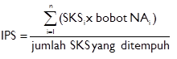

#BAB 4 EVALUASI KEBERHASILAN BELAJAR

Evaluasi keberhasilan belajar yang diuraikan berikut ini berdasarkan kepada :
 1.  Keputusan Rektor Universitas Katolik Parahyangan No. III/PRT/2011-11/211 tentang Evaluasi Keberhasilan Belajar Dalam Mata Kuliah Dan Evaluasi Tahap Keberhasilan Belajar Pada Program Sarjana Dan Program Diploma-III di Lingkungan Universitas Katolik Parahyangan. 
 2.  Keputusan Dekan No. III/FMIPA/2007-04/396-SK tentang Evaluasi Keberhasilan Belajar Tahap Pertama Dan Tahap Kedua Pada Program Stratum-1 Di Lingkungan Fakultas Matematika Dan Ilmu Pengetahuan Alam Universitas Katolik Parahyangan.#

## 4.1 Evaluasi Keberhasilan Belajar Tiap Mata Kuliah
Evaluasi keberhasilan belajar mata kuliah adalah penilaian terhadap hasil belajar 
mahasiswa dalam suatu mata kuliah, yang dilakukan secara menyeluruh dan 
berkesinambungan dalam satu semester dengan cara yang sesuai dengan 
karakteristik mata kuliah yang bersangkutan.

Keberhasilan belajar mata kuliah ditetapkan segera setelah mahasiswa 
**menyelesaikan seluruh Komponen Kegiatan** yang disyaratkan dalam suatu 
mata kuliah. Kriteria keberhasilan belajar mahasiswa dalam suatu mata kuliah 
ditetapkan oleh dosen pembina mata kuliah, dengan menaati rambu-rambu dalam 
SK Rektor dan SK Dekan tersebut di atas.

Evaluasi keberhasilan belajar mata kuliah dilakukan terhadap hasil belajar 
mahasiswa dalam berbagai **Bentuk Kegiatan**, yang masing-masing memiliki 
**Komponen Kegiatan** dan **Komponen Evaluasi** sebagai berikut : 
 
| Bentuk Kegiatan       | Komponen Kegiatan          | Komponen Evaluasi                      |           | 
|---------------------- |----------------------------|----------------------------------------|-----------| 
|                       |                            | Angka                                  | %         | 
| Perkuliahan           | Pelaksanaan Tugas          | Angka Rata-rata Tugas **(ART)**            | 20% - 40% | 
|                       | Tatap Muka                 | Angka Ujian Tengah **(AUTS)**              | 30% - 50% | 
|                       |                            | Angka Ujian Akhir Semester **(AUAS)**      | 30% - 50% | 
| Seminar/Studi Mandiri | Penyajian, Diskusi/Partisipasi,Penyusunan Makalah/Laporan         | Diserahkan ke tiap    fakultas atau prodi | 30% - 50% |
|           Skripsi            | Penyusunan dan penyajian |   Diserahkan ke tiap fakultas atau prodi                                     |      Diserahkan ke tiap fakultas atau prodi     | 

Berdasarkan pertimbangan akademik, Dekan dapat mengubah Komponen Evaluasi bagi suatu Bentuk Kegiatan seperti tersebut di atas,  sejauh tidak bertentangan dengan peraturan perundang-undangan yang berlaku.
   
Keberhasilan belajar mahasiswa dalam suatu mata kuliah dinyatakan dengan **Nilai Akhir (NA)** berupa huruf **A, B, C, D,** dan **E**. Nilai Akhir (NA) **A, B, C,** dan **D** berarti lulus, sedangkan Nilai Akhir **E** berarti **tidak lulus**.
   
Apabila seorang mahasiswa tidak dapat memenuhi salah satu komponen evaluasi yang ditentukan dalam suatu mata kuliah, maka keberhasilan belajar mahasiswa untuk matakuliah tersebut **dapat** dinyatakan Kosong **(K)** oleh Dekan. Jika keberhasilan belajar seorang mahasiswa untuk suatu matakuliah adalah **K**, maka matakuliah ini dianggap belum pernah ditempuh dan tidak diikutsertakan dalam perhitungan Indeks Prestasi.
   
**Komponen Evaluasi** dinyatakan dalam bentuk angka dengan rentang **0 – 100** dengan pembulatan angka pecahan hingga **satuan terdekat**, dengan ketentuan bilangan pecahan ≥ 0,5 dibulatkan menjadi 1 dan bilangan pecahan < 0,5 dibulatkan menjadi 0.
   
Konversi **Angka Akhir (AA)** menjadi **Nilai Akhir (NA)** dilakukan dengan **Penilaian Acuan Patokan (PAP)** sebagai berikut :

| AA     | NA | Bobot NA |
|--------|----|---------|
| 80-100 | A  | 4       |
| 70-79  | B  | 3       |
| 60-69  | C  |2        |
| 50-59  | D  |1        |
| 0-49   | E  |0        |
   
Berdasarkan pertimbangan akademik, Dekan FTIS dapat memutuskan untuk melakukan konversi AA menjadi NA dalam suatu mata kuliah tertentu dengan **Penilaian Acuan Normal (PAN)**.

##4.2 	Evaluasi Keberhasilan Belajar Dalam Suatu Tahap Belajar
Evaluasi keberhasilan belajar dilakukan secara berkesinambungan, sejak mahasiswa mulai masuk ke program studinya. Evaluasi ini terdiri atas:
1.	Evaluasi Keberhasilan Belajar Tiap Semester
2.	Evaluasi Keberhasilan Belajar Tahap Pertama
3.	Evaluasi Keberhasilan Belajar Tahap Kedua
4.	Evaluasi Keberhasilan Belajar Tahap Akhir

###4.2.1  Evaluasi Keberhasilan Belajar Tiap Semester
Evaluasi keberhasilan belajar tiap semester dilakukan segera setelah mahasiswa menempuh UAS. Evaluasi Keberhasilan Belajar tiap semester ini dinyatakan dalam **Indeks Prestasi Semester (IPS)** yang mempunyai rentang **0,00 – 4,00** dan dihitung dengan rumus: 

dengan (sks x bobot NA)i = perkalian jumlah sks dan bobot NA mata kuliah ke-i, n = jumlah mata kuliah. IPS digunakan untuk menetapkan **beban kredit** yang dapat ditempuh mahasiswa pada **semester berikutnya**. 

###4.2.2 	Evaluasi Keberhasilan Belajar Tahap Pertama
Evaluasi Keberhasilan Belajar Tahap Pertama dilakukan **pada akhir 2 (dua) tahun pertama**, atau **pada akhir masa 
studi terpakai selama 4 (empat) semester**, terhitung sejak yang bersangkutan terdaftar sebagai mahasiswa 
UNPAR. Evaluasi Keberhasilan Belajar Tahap Pertama dinyatakan dalam **Indeks Prestasi Tahap Pertama (IPT I)**, dengan 
rentang **0,00 – 4,00**.

Persyaratan yang **harus dipenuhi** pada Evaluasi Keberhasilan Belajar Tahap Pertama adalah telah **lulus minimal 30 
SKS** dan **IPT I minimal 2,00**. Dalam hal ini yang dimaksud dengan IPT I adalah Indeks Prestasi untuk 30 SKS 
terbaik. Jika persyaratan tersebut tidak terpenuhi, maka mahasiswa yang bersangkutan **tidak diijinkan melanjutkan 
studi** pada prodi yang sama di lingkungan UNPAR. Penetapan mahasiswa yang tidak diijinkan untuk melanjutkan studi 
dilakukan dengan surat keputusan Rektor.

Semester di mana mahasiswa diijinkan mengambil **cuti studi tidak diperhitungkan** dalam Evaluasi Keberhasilan 
Belajar Tahap Pertama. 

###4.2.3	Evaluasi Keberhasilan Belajar Tahap Kedua
Evaluasi Keberhasilan Belajar Tahap Kedua dilakukan pada akhir **4 (empat) tahun pertama**, atau **pada akhir masa 
studi terpakai selama 8 (delapan) semester** terhitung sejak yang bersangkutan terdaftar sebagai mahasiswa 
UNPAR.Evaluasi Keberhasilan Belajar Tahap Kedua dinyatakan dalam **Indeks Prestasi Tahap Kedua (IPT II)**, dengan 
rentang **0,00 – 4,00**.

Persyaratan yang **harus dipenuhi** pada Evaluasi Keberhasilan Belajar Tahap Kedua adalah telah lulus minimal 75 SKS 
dan IPT II minimal **2,00**. Dalam hal ini yang dimaksud dengan IPT II adalahIndeks Prestasi untuk 75 SKS terbaik. 
Jika persyaratan di atas tidak terpenuhi, maka mahasiswa yang bersangkutan **tidak diijinkan melanjutkan studi** pada 
prodi terkait di lingkungan UNPAR. Penetapan mahasiswa yang tidak diijinkan untuk melanjutkan studi dilakukan dengan 
surat keputusan Rektor.

Semester di mana mahasiswa diijinkan mengambil **cuti studi tidak diperhitungkan** dalam Evaluasi 
Keberhasilan Belajar Tahap Kedua.

###4.2.4  Evaluasi Keberhasilan Belajar Tahap Akhir
Evaluasi Keberhasilan Belajar Tahap Akhir dilakukan pada akhir masa studi maksimal mahasiswa program Sarjana di 
UNPAR, yaitu 7 (tujuh) tahun, atau pada akhir masa studi terpakai selama 14 (empat belas) semester terhitung sejak 
yang bersangkutan terdaftar sebagai mahasiswa UNPAR.

Evaluasi Keberhasilan Belajar Tahap Akhir dinyatakan dalam **Indeks Prestasi Kumulatif (IPK)**, dengan rentang **0,00 
– 4,00** yang dihitung dengan rumus

dengan (sks x bobot NA)i = perkalian jumlah sks dan bobot NA mata kuliah ke-i, n = jumlah mata kuliah.Mahasiswa 
dinyatakan lulus dari prodi terkait di lingkungan UNPAR setelah memenuhi persyaratan berikut: 

1. Telah lulus **seluruh beban SKS** yang dipersyaratkan dalam kurikulum prodi terkait.
2.	IPK ≥ 2,00.
3.	Masa studi terpakai tidak lebih dari 14 (empat belas) semester.

Jika persyaratan di atas tidak terpenuhi, maka mahasiswa yang bersangkutan **tidak diijinkan melanjutkan studi** pada 
prodi terkait di lingkungan UNPAR. Penetapan mahasiswa yang tidak diijinkan untuk melanjutkan studi dilakukan dengan 
surat keputusan Rektor.

IPK dihitung dengan memperhatikan semua mata kuliah yang pernah ditempuh oleh mahasiswa, dan digunakan untuk 
menetapkan yudisium (sebutan) kelulusan, dengan ketentuan sbb.:

| IPK       | Yudisium                                            | 
|---------- |-----------------------------------------------------| 
| 2,00-2,75 | Memuaskan                                           | 
| 2,76-3,50 | Sangat Memuaskan                                    | 
| 3,51-4,00 | Dengan Pujian (masa studi terpakai ≤ 9 semester)    | 
|           | Sangat Memuaskan (masa studi terpakai > 9 semester) | 

##4.3 	Kemampuan Bahasa Inggris Mahasiswa UNPAR
Berdasarkan Keputusan Rektor Universitas Katolik Parahyangan No. III/PRT/2011-08/148 tentang Standar Kemampuan Bahasa 
Inggris Mahasiswa Universitas Katolik Parahyangan, mulai mahasiswa angkatan 2006 dan selanjutnya, setiap mahasiswa 
program Sarjana dan Pascasarjana wajib memiliki kemampuan bahasa Inggris yang dinyatakan berdasarkan hasil tes di PBB 
(Pusat Pendidikan Berkelanjutan) UNPAR, atau pada lembaga penyelenggara tes resmi di luar UNPAR, dengan skor minimal 
sebagai berikut:

1.	Skor 500 (limaratus) yang diperoleh melalui pelaksanaan tes TOEFL dengan metode tes tertulis (paper-based TOEFL), atau
2.	Skor 59-60 (lima puluh sembilan sampai enam puluh) yang diperoleh melalui pelaksanaan test TOEFL dengan metode tes melalui internet (internet-based TOEFL), atau
3.	Skor 173 (seratus tujuh puluh tiga) yang diperoleh melalui pelaksanaan tes TOEFL dengan metode tes menggunakan komputer (computer-based TOEFL), atau
4.	Skor 5,0 (lima koma nol) yang diperoleh melalui pelaksanaan IELTS.

Untuk mahasiswa Program Sarjana, Skor TOEFL minimal atau skor IELTS minimal tersebut harus telah dicapai oleh 
mahasiswa yang bersangkutan selambat-lambatnyapada saat Evaluasi Studi Tahap 1I. Jika pada batas waktu tersebut 
seorang mahasiswa belum dapat memenuhi skor minimal yang disyaratkan, maka mahasiswa tersebut dapat mengajukan 
permohonan dispensasi kepada Rektor asalkan memenuhi persyaratan tertentu. Tentang dispensasi ini lebih lanjut diatur 
pada pasal 5 dari SK Rektor (lihat lampiran).

