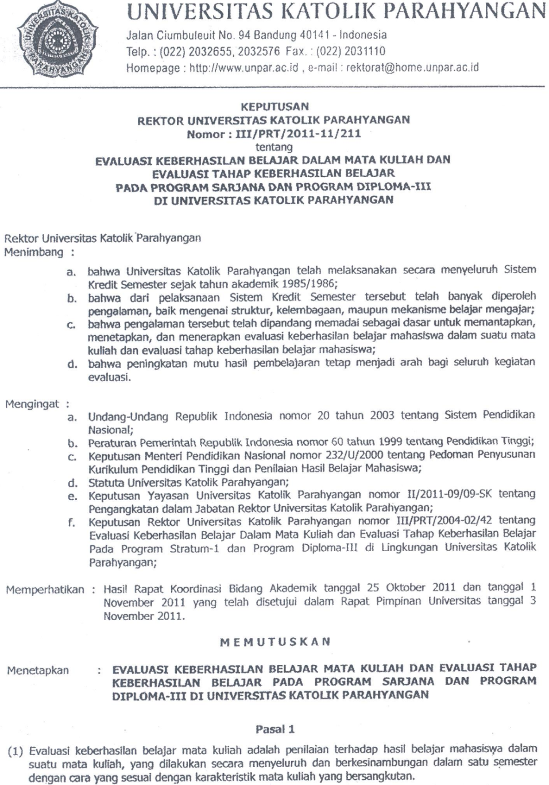
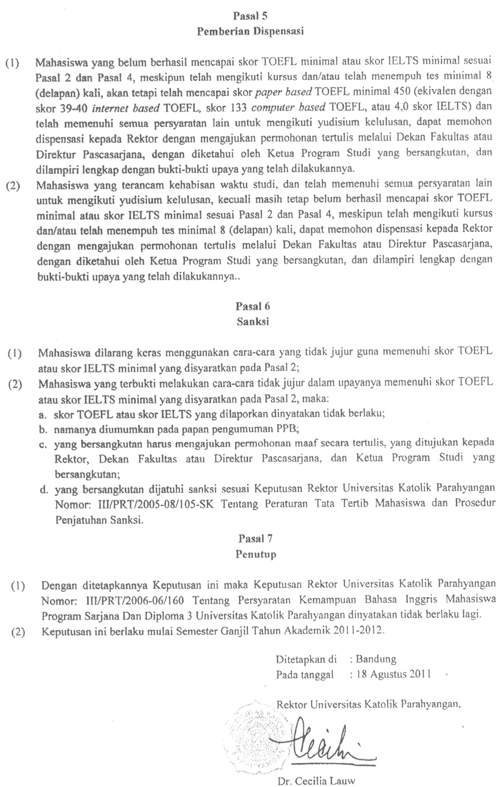
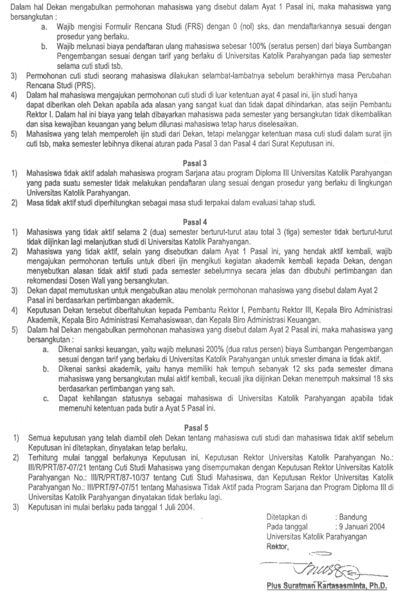
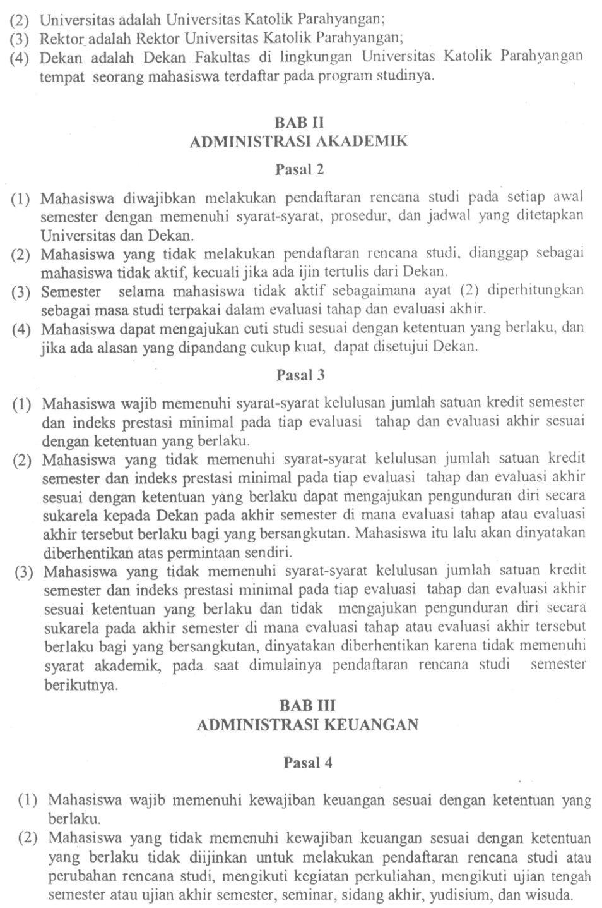

Lampiran  
========

## Lampiran I 
JADWAL AKADEMIK TAHUN AKADEMIK 2014/2015  

| Kegiatan               | Semester Ganjil              | Semester Genap                  | 
|----------------------- |------------------------------|---------------------------------| 
| Perwalian dan FRS      | Senin-Kamis, 21-24 Juli 2014 | Selasa-Jumat, 13-16 Jan. 2015   | 
| Awal perkuliahan       | Senin, 18 Agt. 2014          | Senin, 26 Jan. 2015             | 
| PRS                    | Senin-Selasa, 1-2 Sep. 2014  | Senin-Selasa, 9-10 Feb. 2015    |  
| UTS                    | Senin-Jumat, 6-18 Okt. 2014  | Senin-Jumat, 16-28 Mar. 2015    |  
| Akhir Perkuliahan      | Sabtu, 6 Des. 2014           | Sabtu, 23 Mei 2015              |  
| UAS                    | Senin-Jumat, 8-20 Des. 2014  | Senin-Jumat, 25 Mei-6 Juni 2015 |  
| Pengumuman Nilai Akhir | Jumat, 9 Jan. 2015           | Senin, 24 Juni 2015             |  

## Lampiran II  
JADWAL PEMBAYARAN BIAYA STUDI TAHUN AKADEMIK 2014/2015  

| Tahap                            | Semester Ganjil      | Semester Genap      |  
|--------------------------------- |----------------------|---------------------|  
| Tahap 1 (BRP dan 10 SKS)         | Kamis, 14 Juli 2014  | Jumat, 9 Jan 2015   |  
| Tahap 2 (Pelunasan SKS dan SAPR) | Senin, 29 Sept. 2014 | Senin, 9 Maret 2015 |  

## Lampiran III 
SIDANG SARJANA DAN WISUDA TAHUN AKADEMIK 2014/2015  

|                                        | Periode              |                     |                     | 
|----------------------------------------|----------------------|---------------------|---------------------| 
|                                        | LIX                  | LX                  | LXI                 | 
| Batas akhir pendaftaran Sidang Sarjana | Jumat, 26 Sept. 2014 | Jumat, 16 Jan. 2015 | Jumat, 12 Jun. 2015 |  
| Sidang Sarjana                         | Jumat, 3 Okt. 2014   | Jumat, 23 Jan. 2015 | Jumat, 19 Jun. 2015 | 
| Batas akhir pendaftaran wisuda         | Senin, 6 Okt. 2014   | Senin, 2 Feb. 2015  | Kamis, 25 Jun. 2015 | 
| Wisuda                                 | Sabtu, 1 Nov. 2014   | Sabtu, 28 Feb. 2015 | Sabtu, 8 Agt. 2015  | 

## Lampiran 4 
 
 
 
 
 
 

## Lampiran 5 
 
 
 

## Lampiran 6 
 
 

## Lampiran 7 
 
 
 
 
 
 
